## At a Glance

## IRT Intro & 1PL (Rasch)

### Motivation of IRT and difference to classical test theory

Before we dive deeper into item response theory (IRT), it’s worth taking a step back and considering what the starting point is and why it makes sense to examine it from an IRT perspective.

In the social sciences, we often face the problem that what we want to measure (e.g., attitudes, personality traits, etc.) cannot be directly observed or measured.
Therefore, we attempt to operationalize these abstract concepts using tools such as questionnaires.
This leads to a distinction between two levels.
On the one hand, we have the latent level.
This is the level that cannot be directly observed, where the constructs we are interested in are located.
On the other hand, there is the manifest level.
This is the observable level where our operationalizations are located—for example, the responses people have given on a questionnaire.
It is important to note that these two levels are not equivalent and that there is a gap between them.
This is a problem because we are usually interested in latent person and item characteristics, but we only have data with responses at the manifest level.
Therefore, we need something that describes how the observed manifest level (e.g., item responses) is related to the unobservable latent construct that we actually want to measure.
We call this “something” that describes these relationships a *statistical* or *psychometric* *model*.

Put simply, a statistical model attempts to predict the observed data based on latent variables.
For this, we can ask our selfs: "What variables influence the responses to an item?".
Intuitively two influences may come to mind:

1.  The characteristics of the person answering the item (this usually refers to the latent trait we want to measure)

2.  The properties of the item being answered

That seems reasonable.
For example, one would expect that the more environmental concern a person has (a latent trait of the person), the more likely they are to agree with an item that advocates for stronger climate protection measures.
On the other hand, the characteristics of the item also influence how respondents answer it.
For example, how clearly the item is worded, or how difficult it is to agree with the item.

IRT combines these two approaches by taking into account the influence of both persons (latent constructs) and items.
This represents a fundamental difference from classical test theory (CTT) [@wilson2023 p. 139] and is a major advantage of IRT over CTT.
This is evident in several ways.
First, IRT always models a person’s response to a specific item.
CTT, by contrast, models the total score and thus completely ignores the characteristics of individual items.
In IRT, there are model parameters that refer to the person and are constant across all items, but there are also parameters that are item-specific.
As a result, IRT explicitly addresses the various influencing factors (person + item)—unlike CTT—and represents a multilevel structure, since responses to different items from the same person can be grouped together, meaning that item responses are nested within persons.
Therefore, IRT models can also be understood as generalized linear mixed models.
So let's take a closer look at that next

> Good references: @wilson2023

- Idea of the wright map

  - make the distinction between the manifest and latent level

  - we need something to relate the observed/manifest variables with the latent construct we are interested in

  - This something is a statistical or psychometric model

- 

*In summary: We have observed people's responses to our items (manifest level). This response data is mostly categorical or dichotomous, due to the use of Likert scales. On the other hand, we are interested in individuals’ scores on constructs/traits that are not directly observable (latent level) and would also like to account for the influence of the items. To address this situation, we therefore need a model that can predict the observed responses while using the latent construct and the properties of the items for prediction (Wright map).*

## IRT from a regression perspective (illustrated for the simplest case: 1PL/Rasch -\> dichotomous items) - written by Piotr

> Good references: @boeck2011 @rijmen2003

- Intuitively we can think of IRT as a logistic (or multinomial in the case of polytomous items) regression

  - We want to predict a dichotomous dependent variable (the item responses) based on the characteristics of the persons and on the characteristics of the items

### IRT as Generalized linear mixed models

- More precisely IRT models can be understood as Generalized linear mixed models

- GLMM components

  - Random component/conditional distribution:

    - We want to predict, if a person answers an Item with 1 or 0. So the AV follows a Bernoulli distribution, where $\pi_{pi}$ gives the probability, that a 1 is drawn from that distribution

  - Linear component:

    - Contains for every person and item pair a linear combination of predictors to predict the item response of this person

    - We assume that the response of a person on an item is influenced by the characteristics of the person (trait) and characteristics of the items

    - Therefore we have one person specific predictor (random effects) and one predictor for every item (fixed effects)

  - Linking component:

    - Problem: linear component can give values from $-\infty$ to $\infty$ but we want to predict a probability which can only takes values from $[0;1]$

    - Solution: We need a function which maps the predictions of the linear component on the interval from \[0:1\] -\> logit-function

- IRT is a family of models that specify the relationship between the latent trait $\theta$ (“theta”) and a link-transformation of probability of $y_{is} = 1$ @hoffman2024

### IRT as CFA *(see Lesa Hoffman)*

- CFAs are also related to linear regressions, because they have basicly the same form only the parameters are named differently:

  - lineare Regression: $y_{is} = \beta_{0i} + \beta_{1i}x_s + e_{is}$

  - CFA: $y_{is} = \mu_i + \lambda_iF_s + e_{is}$

- We learned that IRT models are Generalized linear mixed models, which can deal with categorical/ordinal data, therefore we can also think about IRT models as CFA models for categorical responses

*After this we have established the formula for the 1PL/Rasch model (Note item difficulty instead of easiness to get* $\theta_p - \beta_i$)

## A working example: Environmental concern

To illustrate the usefulness of IRT, we will apply what we’ve learned to a real-world example throughout this tutorial.
To do so, we’ll use data from the paper by @gomm2026, which developed the *New environmental concern scale (ECo scale)* for assessing environmental concerns using IRT.

The [data](https://doi.org/10.7910/DVN/ZMQRIH) from this paper has been made publicly available, so you can download it yourself and follow along with the code examples.

**The ECo scale consists of the following nine items:**

Instruction: *What do you think about the following statements and questions?*

| Item | Item text |
|------------------------------------|------------------------------------|
| 1 | I am worried when thinking about the environmental conditions in which our children and grandchildren are likely to live. |
| 2 | If we continue in the same way, we are heading towards an environmental disaster. |
| 3 | We worry too much about the future of the environment and not enough about prices and jobs today. |
| 4 | At present, the majority of the population in our country is still not acting in a very environmentally conscious way. |
| 5 | In my opinion, environmentalists strongly overstate the significance of the environmental problem. |
| 6 | Environmental protection measures should be enforced even if jobs are lost. |
| 7 | How willing are you to pay much higher prices to protect the environment? |
| 8 | How willing are you to pay much higher taxes to protect the environment? |
| 9 | How willing would you be to accept cuts in your standard of living in order to protect the environment? |

In the original scale, all items are answered on a five-point Likert scale (Response scale (statements): *Does not apply at all* (1) to *Fully applies* (5).
Response scale (questions): *Very unwilling* (1) to *Very willing* (5)).
Item 3 and Item 5 are reverse coded.

Please note that for this tutorial, the data has been dichotomized.
This means that responses from participants who somewhat agreed with an item (responses \> 3) were coded as 1.
Responses from participants who somewhat disagreed with an item (responses \< 3) were coded as 0.
The responses of participants who answered an item with a 3 were randomly coded as either a 1 or a 0 with a 50% probability.
This dichotomization is necessary because the models covered in this tutorial only work with dichotomous response formats.
However, in a future tutorial, we will also cover IRT models for polytomous response formats.

So let's prepare our data:

First we have to load some packages and the dataset.

```{r}
#| message: false

# load packages

library(dplyr) 
library(tidyr) 
library(mirt)

# load data

load("C:/Users/martinln/Documents/IRT_tutorials_alt/Example_data_irt/ECo scale Quoß/envatt_reduced.Rda")

```

Now let's clean our data and bring it in an effective form to work with it.

```{r}
#### clean up data

dat_quoß <- w7                                                # <1>
rm(w7)                                                        # <1>

dat_eco <- dat_quoß %>%                                       # <2>
  select(w7_q10x1, w7_q10x2, issp6,      # affective          # <2>
         w7_q10x5, w7_q10x6,  w7_q10x9,  # cognitive          # <2>
         issp2, issp3, issp4             # conative           # <2>
  ) %>%                                                       # <3>
  drop_na()                                                   # <3>

names(dat_eco) <- c("Eco_aff_1", "Eco_aff_2", "Eco_aff_3",    # <4>
                    "Eco_cog_4", "Eco_cog_5", "Eco_cog_6",    # <4>
                    "Eco_con_7", "Eco_con_8", "Eco_con_9")    # <4>

# Item 3 and 5 are reverse coded and have to be inverted

dat_eco <- dat_eco %>%                                        # <5>
  mutate(Eco_aff_3_r = 6 - Eco_aff_3,                         # <5>
         Eco_cog_5_r = 6 - Eco_cog_5)                         # <5>

# uncomment to check if recoding was sucessfull:
# View(dat_eco[, c("Eco_cog_5", "Eco_cog_5_r")]) 


```

1.  First we save the loaded dataset in a new object named "dat_quoß", which is more meaningful tha "w7".
    We can delete the old "w7" object from the environment with `rm()`

2.  Next we can reduce the dataset to the variables we actually need (the items of the ECo scale) and save the results in the new object "dat_eco".
    For this we use the `dplyr` package [@wickham2026] from the tidyverse, which is aa very helpful package to handle data.
    With the `select()` function we select all variables/columns from our dataset, that we want to keep.

3.  Here we drop all rows which contain missing values

4.  In our dataset which only contains the ECo scale items (`dat_eco`) we can now also rename our variables/item so that is easier to see which item is which.
    For this we use the following logic: first three letters specify the scale (ECo scale), the next three letters specify the dimension they measure [see @gomm2026], the number at the end gives the number of the item in the scale.

5.  The ECo scale contains two reversed coded items (Item 3 and 5).
    To recode the two items, we use the `mutate()` function from the `dplyr` package to create two ne variables (columns).
    On the left side of `=` we name our new variable.
    On the right side of `=` we define how the new variable is build.
    Since the Likert-Scale of the ECo scale has 5 points, we can invert the responses by subtracting the person's answer from 6.
    For example, if a person selected the highest response option on the Likert scale (5), then that person should select the lowest response option (1) on the recoded item.
    When we apply our “formula,” we see that this is exactly what happens: 6 - 5 = 1

As discribed above we have to dichotomize the responses:

```{r}
# build data set with dichotomouse responses

dat_eco_dicho <- dat_eco %>%                                           
  mutate(across(                                                       # <1>
    .cols = everything(),                                              # <1>
    .fns = function(x){                                                # <2>
      # ifelse(x < 3, 0, ifelse(x > 3, 1, rbinom(1, 1, 0.5)))          # <2>
      out <- ifelse(x < 3, 0, ifelse(x > 3, 1, NA))                    # <2>
      idx <- which(x == 3)                                             # <2>
      out[idx] <- rbinom(length(idx), 1, 0.5)                          # <2>
      out                                                              # <2>
    },                                                                 # <2>
    .names = "{.col}_dicho"                                            # <3>
  ))
```

1.  This code creates new variables as we can see by the `mutate()` function, by apply a self defined function on every variable/column in our dataset.

2.  Here we specify the function which should be applied to every collumn on the dataset.
    The function takes the values of a column (`x`) and tests for each value in the column if the value is bellow 3.
    If this is the case, than the value is recoded in a 0.
    If the value is above 3 than the value gets recoded in a 1.
    If the value is exactly 3, that the value is recoded in a missing value.
    In the next step we get the positions of every value in our column which is exactly 3.
    Next we set ne values for all values which are exactly 3 by sampling from a binomial distribution.
    By sampling from a binomial distribution with `prob = 0.5` we get a 1 with a probability of 50%.

3.  Here we define how the ne created variables should be named.
    For this, the current column name is used ("{.col}") and extended by the ending "\_dich"

## The Rasch Model (1PL)

Following this conceptual introduction, let's take a closer look at the first IRT model.

The Rasch model is a statistical model that links the latent level to the manifest level by predicting the probability that a person will choose response 1 for a given item.
The Rasch model always assumes dichotomous response formats, in which the responses are typically coded as 0 and 1.
Generally speaking, 1 represents an success and 0 a failure.
In our example with the ECo-Scale, a success can be interpreted as agreement with the item and a failure as disagreement with the item.
In achievement testing, however, 1 could also mean “Correct” and 0 could mean “Incorrect.”

### Model formula

The Rasch model is described by the following formula:

$$P(Y_{ni} = 1) = \frac{\exp(\theta_n - \beta_i)}{1 + \exp(\theta_n - \beta_i)}$$ {#eq-rasch}

Let's take a look at the individual components to better understand the formula:

On the left side of the equation is the probability that a person $n$ will answer item $i$ with a 1 ($P(Y_{ni} = 1)$).
Thus, $Y_{ni}$ denotes the response of person $n$ to item $i$ and can take the values 0 or 1.
In the framework of regression, this probability $P(Y_{ni} = 1)$ is therefore our dependent variable, which we want to predict.

To make this prediction, we need predictors.
The Rasch model assumes two predictors or parameters:

- the persons ability/trait ($\theta_n$)

- the difficulty of the item ($\beta_i$)

The rest is the logistic function $f(x) = \frac{e^x}{1 + e^x}$, which we use as a link function $g()$ to predict a probability (see IRT as logistic regression).
We then simply set $x = \theta_n - \beta_i$.

### 1PL

Before we take a closer look at what the model parameters actually mean, it is worth noting that the Rasch model is sometimes referred to as the 1PL model.
The 1PL stands for One-Parameter Logistic Model.
The "One" refers to the number of item-specific parameters.
As we can see in the equation, there is only one parameter that has an index $i$ and can therefore vary for each item: the item difficulty $\beta_i$.
Later on, however, we'll also learn about IRT models with more item-specific parameters.

Strictly speaking, however, the Rasch model is a special case of a 1PL model.
This is because the 1PL model is defined as follows:

$$P(Y_{ni} = 1) = \frac{\exp(\alpha(\theta_n - \beta_i))}{1 + \exp(\alpha(\theta_n - \beta_i))}$$ {#eq-1PL}

As we can see, this formula looks almost identical to the Rasch model, except that a new parameter $\alpha$, has been added.
This is the discrimination parameter, which we will examine in more detail later.
What we can see now, however, is that we only refer to a Rasch model when $\alpha = 1$.

Even though this may seem like a minor difference—and is mathematically equivalent—there are different philosophical perspectives underlying it [@deayala2022, p. 20].
Compared to the Rasch model, the 1PL model is designed to fit the data as closely as possible.
This is because the 1PL model is more flexible than the Rasch model; the $\alpha$ parameter does not have to be 1, so the model can "try out" different $\alpha$ values to determine which $\alpha$ yields the best fit to the data.
The Rasch model does not allow for this kind of flexibility, since alpha must equal 1 in this model.
However, this restriction ensures a consistent scaling that allows for comparability across different Rasch models.

- AV = probability of person $p$ two answer item $i$ with 1 ($P(Y_{pi} = 1)$)

- Two Parameters/predictors are influencing this probability

  - the persons ability/trait ($\theta_p$)

  - the difficulty of the item ($\beta_i$)

- Therefore we can say that probability is depending on the values of the predictors $P(Y_{pi} = 1|\theta_p, \beta_i$) ( @wilson2023 p. 136)

- since each item is thus characterized by only one parameter ($\beta_i$) this model is also called the 1PL

  - we take later a look at models with more than one itemspecific parameter

  - Difference Rasch vs. 1PL: Rasch is a special case of 1PL where $\alpha = 1$

    - Other 1PL model can have $\alpha \neq 1$.
      NOTE: In 1PL models $\alpha$ is NOT item specific to ensure parallel ICCs

    - <mark>Is this to technical for a beginner tutorial?
      Especially because the discrimination parameter is introduced in the 2PL part</mark>

### Interpretation of model parameters {#sec-mod_par}

Let’s take a closer look at the two model parameters.

$\theta$ refers to the person parameter - that is, the latent construct we want to measure.
Since the latent construct represents a continuum, the $\theta$ parameter requires the index $n$, because each person is located at a different point on the continuum.
In our example, $\theta$ would be “environmental concerns,” and $\theta_n$ would be the level of environmental concerns of person $n$.

$\beta$ is the item difficulty.
The $\beta$ parameter has the index $i$ because items vary in difficulty.
The term “difficulty” stems from the historical background of the IRT, which was developed primarily for achievement and ability applications.
In the context of personality assessment or the measurement of attitudes, difficulty can be understood as how easy it is for individuals to agree with or disagree with an item.
A more neutral term, which is therefore also frequently used to refer to item difficulty, is “item location” [@wilson2023; @deayala2022].

The term “location” highlights an important property of IRT models.
Specifically, $\theta$ and $\beta$ lie on the same continuum or scale.

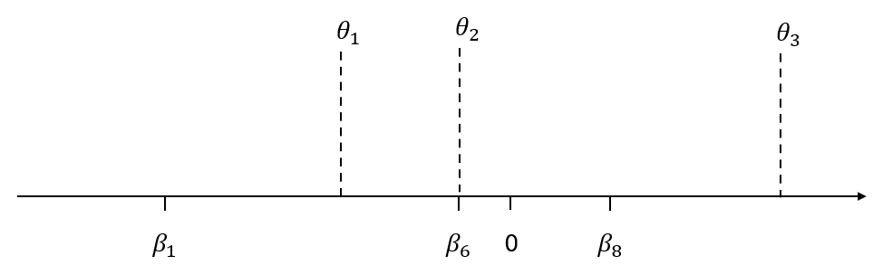{#fig-one_continuum}

In our example, the continuum represents environmental concerns.
We can now compare individuals with one another and see, for example, that Person 1 ($\theta_1$) has the lowest level of environmental concerns compared to the other two individuals.
Conversely, we can also compare the items with one another.
For example, Item 1 ($\beta_1$) is a “easy” item, since it requires only a low level of environmental concerns to agree with it, while Item 8 is a “difficult” item, since one must have a fairly high level of environmental concerns to agree with it.
This also makes intuitive sense when we look at what Item 1 and Item 8 of the ECo scale ask.
Item 1 asks: "I am worried when thinking about the environmental conditions in which our children and grandchildren are likely to live." That's a statement most people can probably agree with.
In contrast, Item 8 asks "Are you willing to pay much higher taxes to protect the environment?" Something that probably far fewer people are willing to do.
Therefore Item 8 is more "difficult" to agree with and has a higher $\beta$ than item 1.

However, since $\theta$ and $\beta$ are now on the same continuum, we can also compare $\theta$ with $\beta$.
For example, we might expect Person 1 ($\theta_1$) to agree with Item 1 because Person 1 has higher environmental concerns than the location associated with Item 1.
At the same time, one would expect Person 1 to be more likely to disagree with Item 8, since Person 1 has much lower environmental concerns than the point at which Item 8 is located.

Using the formula from the Rasch model, we can actually calculate the probability of the responses precisely, rather than just estimating it visually: Let's say $\beta = -1.343$ and $\theta_1 = -0.5$, than we can just plug in the values in the Rasch formula to calculate the probability that Person $n = 1$ answers item $i = 1$ with 1 (= agree):

$$P(Y_{11} = 1) = \frac{\exp(\theta_1 - \beta_1)}{1 + \exp(\theta_1 - \beta_1)} = \frac{\exp(-0.5- (-1.343))}{1 + \exp(-0.5 - (-1.343))} = 0.70$$

This result indicates that the Rasch model estimates the probability that Person 1 will answer Item 1 with a 1 to be 70%.

We can do this again with Item 8.
Let's assume that $\beta_8 = 0.347$.
Than we can calculate the probability that Person $n = 1$ answers item $i = 8$ with 1 (= agree):

$$P(Y_{18} = 1) = \frac{\exp(\theta_1 - \beta_8)}{1 + \exp(\theta_1 - \beta_8)} = \frac{\exp(-0.5- 0.347)}{1 + \exp(-0.5 - 0.347)} = 0.30$$

This result indicates that the Rasch model estimates the probability that Person 1 will answer Item 8 with a 1 to be 30%.

Let's work through one last example.
Let's assume $\beta_6 = -0.5$ for Item 6.
Than we can calculate the probability that Person $n = 1$ answers item $i = 6$ with 1 (= agree):

$$P(Y_{16} = 1) = \frac{\exp(\theta_1 - \beta_6)}{1 + \exp(\theta_1 - \beta_6)} = \frac{\exp(-0.5- (-0.5))}{1 + \exp(-0.5 - (-0.5))} = 0.50$$

As we can see, the probability that Person 1 will solve Item 6 is exactly 50%.
Here we can observe something interesting: namely, that if a person's ability matches the item's difficulty (i.e., $\beta_i = \theta_n$), then the probability of solving it is 50%.
In fact this is the definition of item difficulty: The item difficulty is the point on the theta continuum at which the probability that the person will solve the item is exactly the same as the probability that the person will not solve it.

This shows us that, ultimately, only the discrepancy between $\theta_n$ and $\beta_i$ is relevant to the probability that a person will agree with an item.
The rest of the formula serves only to restrict the result to a range between 0 and 1, so that we can interpret the results as probabilities (link-function).

This means, the higher the $\theta_n$ (e.g. the higher the environmental concerns of a person are) compared to the $\beta_i$ (e.g. amount of environmental concerns required to have a probability to agree with the item of 50%), the higher is the probability that a person will agree with an item.

Conversely, the higher $\beta_i$ (e.g., the level of environmental concern required to achieve a 50% probability of agreement) compared to $\theta_n$ (e.g., the greater a person’s environmental concern), the lower the probability that a person will agree with an item.

In other words, the greater the discrepancy between $\theta_n$ and $\beta_i$, the more the probability that a person will agree with the item deviates from 50%, and the more certain we are of our prediction.

:::::: {.callout-note appearance="simple"}
## Let's do it in R

Now that we understand the logic behind the Rasch model, the question arises: How do we actually know the $\theta$ and $\beta$ values for the individuals and items, respectively?
Although the exact mathematical background and various estimation procedures are beyond the scope of this tutorial, in simple terms, the parameters of the Rasch model can be estimated based on a dataset containing the respondents’ item responses.
This involves using a search algorithm that attempts to determine the $\theta$ and $\beta$ values for each person and each item in such a way that the model can predict the data as accurately as possible.
As a practitioner, this is very easy to implement thanks to statistical software.
In this tutorial, we’ll use the statistical programming language R and the `mirt` package [@chalmers2012] for this purpose.

```{r}
#| message: false

# install and load the mirt package for IRT analyses

#install.packages("mirt") 
library(mirt)
```

::: column-margin
You only need to run `install.packages()`only once, if you haven't already installed the `mirt` package yet.
:::

Using the `mirt()` function from the `mirt` package, we can now fit a Rasch model to our example data from the ECo-Scale.
The `mirt` function expects the following arguments:

```{r}
# estimate the Rasch model with the mirt() function
eco_rasch <- mirt(data = dat_eco_dicho[12:20], # <1>
                  model = 1,                   # <2>
                  itemtype = "Rasch",          # <3>
                  SE = TRUE)                   # <4>
```

1.  `data` = Here, we pass our dataset, which contains the responses of all participants to the items on our scale.

2.  `model` = This argument affects how the model is estimated.
    A single number indicates how many latent constructs our measurement instrument measures.
    Since the ECo Scale measures a single latent trait (environmental concerns), we can leave the default value (= 1) as is.

3.  `itemtype` = As we'll see later, `mirt` is capable of fitting a wide variety of IRT models.
    Using `itemtype`, we therefore tell `mirt` which IRT model we want to fit to the data.
    Since we want to fit a Rasch model, we pass the string “Rasch” to the argument here.

4.  `SE` = If this argument is set to `TRUE`, standard errors for the model's parameters will also be included in the output.
    If we don't want that, we can simply set the argument to `FALSE` or omit it.

::: column-margin
Note that we save with `<-` the results of the `mirt` function in an object (= `eco_rasch`).
This allows us to save the Rasch model in our environment.
It also enables us to retrieve only specific information and parameters from the model and use them in other R commands.
:::

```{r}
#| lst-label: lst-print-rasch
#| lst-cap: Summary of the Rasch model

print(eco_rasch)
```

When we use `print()` to output our mirt object, we first see a summary with general information about our model.
The first block contains information about the estimation method that `mirt()` used to estimate the model.
The lower block contains fit criteria regarding the model fit.
The exact estimation algorithm is beyond the scope of this tutorial.
To put it simply, however, the model parameters are estimated by first substituting random values for the $\theta_n$ and $\beta_i$ and then checking how likely it is to observe the data we have collected.
In the next step, new values for $\theta_n$ and $\beta_i$ are substituted, and it is checked whether these values are more likely to produce the data pattern we have collected.
This process is repeated many times until the parameter values that most likely fit our observed data are found.
Since this process can theoretically take an extremely long time, the algorithm must be given termination rules.
There are two options here, which we can also see in the output.

First, there is the tolerance.
This specifies how small the change in the probability of the parameters must be, given the data, for the algorithm to terminate.
The reasoning behind this is that if, under the new parameters, the data is only, say, 0.0001% more likely than under the parameter values from the previous iteration, then it no longer makes sense to continue optimizing the parameters, since the increase in probability is so small that it is practically irrelevant.
We see that the default tolerance of `mirt` is 0.0001 (1e-04).
This makes `mirt` more lenient than other software, where the tolerance is often set to 0.00001 (1e-05).
However, you can also set the algorithm’s tolerance manually by adding the `TOL` argument to the `mirt()` function.

```{r}
#| eval: false

# Example for estimation with smaller tolerance

mirt(data = dat_eco_dicho[12:20], 
     model = 1, 
     itemtype = "Rasch", 
     SE = TRUE, 
     TOL = 1e-5)
```

Second, you can define a maximum number of iterations after which the algorithm terminates, regardless of whether a unique solution for the parameters has been found or not.
By default, `mirt` allows a maximum of 500 iterations.
In the output, we can see that only 25 iterations were needed for our Rasch model.
However, more complex models may well require more iterations.
Sometimes, the model may reaches the maximum possible number of steps without converging to a unique solution.
When this happens, the parameter estimators are unstable and should not be interpreted [@debelak2022, p. 148] .
`mirt` will then display a message stating that `EM cycles terminated after 500 iterations`.
Therefore, you can set your own maximum number of iterations using the argument `technical = list(NCYCLES = 1000)`[@debelak2022, p. 148].

```{r}
#| eval: false

# Example for estimation with increased maximum cycles

mirt(data = dat_eco_dicho[12:20], 
     model = 1, 
     itemtype = "Rasch", 
     SE = TRUE, 
     TOL = 1e-5, 
     technical = list(NCYCLES = 1000)
     )
```

We can also quickly check whether our estimation algorithm has found a solution or put differently whether it was able to successfully estimate the model.
To do this, we can test whether the variables `converged` and `secondordertest` in our Rasch model have become `TRUE`.

```{r}
# is the estimation algorith converged?
eco_rasch@OptimInfo$converged

# has the estimation algorith found plausible Maximum/Minimum
eco_rasch@OptimInfo$secondordertest
```

Although we have estimated a Rasch model with the `mirt()`function, we initially see only a summary of how the model was estimated and how well it fits the data overall, when we use `print` to display the model—but we don't see any $\theta$ or $\beta$ values.
This is because `mirt` provides us with a large amount of information about our model and stores it in the `eco_rasch` object.
We can see this, for example, by clicking in the environment the blue arrow next to `eco_rasch` or by running `str(eco_rasch)`.
When we do this, we see that the `eco_rasch` object is quite large and nested, and contains far too much information to display all at once.
Therefore, we need to specifically retrieve the information we’re interested in from the object.

For example, to access the item parameters, we can use the `coef()` function.
The `coef()` function expects the following arguments, among others:

```{r}

# extract the itemspecific parameters from our Rasch model
item_par_eco_rasch <- coef(eco_rasch,       # <1>
                           IRTpars=TRUE,    # <2>
                           simplify=TRUE)   # <3>
```

1.  An object that contains the estimated model—in our example, `eco_rasch`

2.  `IRTpars` = This argument determines whether the item location is specified as item difficulty or item ease.
    If we set the argument to `TRUE`, we obtain the $\beta$ values as we have come to know them as item difficulties.
    If the argument is omitted or set to `FALSE`, the item ease is output instead.
    This means that the higher the item ease, the lower the $\theta$ value required for the probability of answering the item with a 1 to be 50%.

3.  `simplify` = If this argument is set to `TRUE`, the output is simplified and presented in a clearer format.
    However, if you also want to obtain the confidence intervals for the item parameters, you can set `simplify` to `FALSE` or omit it.

Let's take a look at the output of our new `coef`-object.

```{r}
#| lst-label: lst-rasch-item-param
#| lst-cap: Item parameters of the Rasch model

item_par_eco_rasch
```

The output consists of three sections:

1.  `$items`: Here we find all item-specific model parameters.
    The items are listed in the rows.
    As we have learned, the Rasch model has only one item-specific parameter, namely the item difficulty $\beta_i$.
    This is shown in column `b`.
    The other columns represent additional item-specific model parameters that also play a role in other IRT models, but which we can ignore in the case of a Rasch model.

2.  `$means`: This contains the latent means of all latent factors assumed by our model.
    Since we assume only one latent factor (environmental concerns) in our model, the output shows only this latent factor (labeled `F1`).
    Here, the latent mean is 0.
    This means that individuals with a $\theta = 0$ have an average level of environmental concerns.

3.  `$cov`: Here we find a variance-covariance matrix for our latent factors.
    However, since we assume only one latent factor in our model, we see only a 1 $\times$ 1 matrix—that is, the covariance of the latent factor with itself—which simply corresponds to the variance within the latent factor.

If we want to extract the individual parameters ($\theta_n$) from our Rasch model/`mirt` object (`eco_rasch`), we can use the `fscore()` function.

```{r}
# extract the personspecific parameters from our Rasch model
person_par_eco_rasch <- fscores(eco_rasch)

head(person_par_eco_rasch)
```

::: column-margin
Note that our dataset consists of 7,932 individuals.
Therefore, when we use `fscore()`, we also get 7,932 different $\theta_n$ values (one per individual).
To keep the output concise, we use `head()` to display only the first 6 $\theta_n$ values out of the 7,932 $\theta_n$ values we have stored in `person_par_eco_rasch`.
:::
::::::

### Visualizations of the Rasch Model

#### Item Characteristic Curve

We can also visualize these relationships.
To do so, we can conduct a small thought experiment: Imagine we select an item for which we know the item difficulty.
Now we calculate the probability that a person will answer with a 1—but no longer for a specific person, rather for every possible $\theta_n$ value.
If we then create a plot where the x-axis represents $\theta$ and the y-axis represents the probability that the item will be answered with a 1, we can see for every possible person how high their probability is that they will agree with the item.
Such a plot is called an *item characteristic curve* (ICC) or *item response function* (IRF).

As an example, the ICC for Item 6 of the ECo scale is shown in the following:

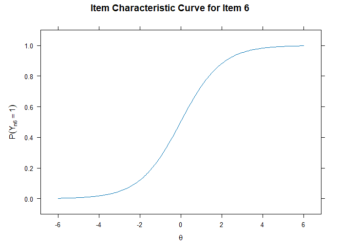{#fig-ICC6_Rasch}

In the case of the Rasch model, we have the distinctive feature that the item difficulty always lies at the inflection point of the ICC.
In our example, item 6 has an item difficulty of $\beta_6 = -0.018$.
If we go to the corresponding point on the x-axis in @fig-ICC6_Rasch and look at the height at which the blue line intersects the y-axis, we see that at the $\theta$ point of -0.018, the probability of answering the item with 1 is 50%, and visually we can see here that the curve also changes the direction of its slope at this point (= definition of the inflection point), because left of the item difficulty, the slope of the probability increases steadily, and right of the item difficulty, the slope of the probability decreases steadily.

We can now conduct our thought experiment not only for a single item, but also for all items on the scale, so that we can calculate an ICC curve for each item:

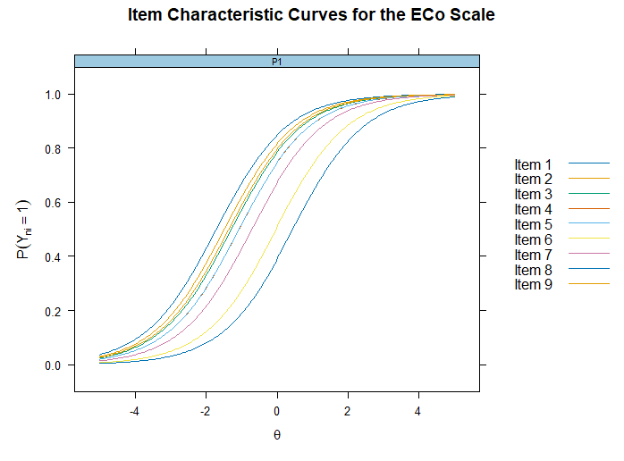{#fig-ICCEco_Rasch}

When we consider multiple items or ICCs simultaneously, we see in @fig-ICCEco_Rasch that the varying item difficulties result in a shift of the ICCs along the x-axis.
This makes sense, since a more difficult item lies further to the right on the $\theta$ continuum.
Accordingly, the point where the ICCs intersect a 50% probability—or their inflection point—must also lie further to the right.
This shifts the entire curve to the right.

It is important to note that, under the Rasch model, the ICCs are all parallel to one another, meaning there is no overlap between the curves.
As a result, the probability that an item will be answered with a 1 is always lower for a more difficult item than for an easier item, for all values of $\theta$.
We can see this because the ICCs further to the right (= more difficult items) are always lower than the ICCs to the left (= easier items), regardless of where on the $\theta$ scale the items are compared.

Conversely, however, we can also see that individuals with higher $\theta$ scores are on all items more likely to answer the item with a 1 than individuals with lower $\theta$ scores.
We can see this in the ICC plot as well.
For example, the y-values of the ICCs at $\theta = 2$ are higher for each item than at $\theta = -2$.

::: {.callout-note appearance="simple"}
## Let's do it in R

To plot the ICC for a single item from our ECo scale, we can use the `itemplot()` function.
This function expects the following arguments, among others:

```{r}
# plotting a ICC of a specific item

itemplot(eco_rasch,     # <1>
         item = 6,      # <2>
         type="trace")  # <3>
```

1.  `object`: Here, we pass in the IRT model that we estimated using the `mirt()` function (here: `eco_rasch`.

2.  `item`: Here, we specify which item we want to plot.
    We can either enter a number or the item name.
    So instead of 6, we could also specify “Eco_cog_6_dicho”

3.  `type` = Here we can specify what should be plotted.
    To obtain the ICC, select “trace.”

If we want to plot the ICCs for all items at the same time, we can use the `plot()` function:

```{r}
# plot all ICCs of a scale

plot(eco_rasch,          # <1>
     type="trace",       # <2>
     theta_lim=c(-5,5),  # <3>
     facet = FALSE)      # <4>
```

1.  `object`: Here, we pass in the IRT model that we estimated using the `mirt()` function (here: `eco_rasch`.

2.  `type` = Here we can specify what should be plotted.
    To obtain the ICC, select “trace.”

3.  `theta_lim`: Here, we can specify the range of $\theta$ values shown in the plot.
    In other words, we can specify the portion of the x-axis that should be plotted.

4.  `facet`: If we set this argument to `FALSE`, all ICCs are plotted on a single graph.
    If we set the argument to `TRUE` or omit it, we get a grid of plots, with the ICC for each item plotted in each cell.

Here's another example of what happens when you set `facet = TRUE`:

```{r}
plot(eco_rasch, type="trace", theta_lim=c(-5,5), facet = TRUE)
```
:::

#### Wright Map

the more items our scale consists of, the more confusing the ICC plots can become [@wilson2023].
Another useful visualization from which we can also learn a lot of information is the so-called *Wright Map*, also known as the *Person Item Map*.
To do this, we take advantage of the fact that, in the Rasch model, the probability that a person will answer “1” for an item actually depends on only two parameters ($\theta$ and $\beta$), and we can place both parameters on the same latent scale [@wilson2023, p. 142].
We're already familiar with this idea from the section where we looked at the meaning of the model parameters ([see Section @sec-mod_par]) , and in fact, we had already worked there with a kind of Wright map in the form of @fig-one_continuum .

Nevertheless, let's now take a closer look at the Wright map using a fictional example shown in @fig-wright_map_example .
The axis on the left side labeled “Logits” represents our latent continuum, on which we can locate our individuals and items.
The x-axis represents the different items.
Accordingly, the points on the graph represent the item difficulties $\beta_i$.
For example, we can go to the point labeled “Item 3” on the x-axis, read the corresponding y-value for the point $\beta_3$, and see that this item has a $\beta_3$ of approximately -1.8.
On the left, labeled “Respondents,” we see a histogram that extends along the “Logits” scale.
Here we find our individual parameters $\theta_n$.
Since we often have large samples (for example, $n = 500$ individuals are simulated here), it would be very confusing to plot every single $\theta_n$ value.
Therefore, a histogram is provided here.
We see that, in our example, this follows a normal distribution, with most individuals in our sample having a $\theta$ value centered around 0.
Very large or very small $\theta$ values, on the other hand, are very rare.
For further illustration, three individuals with different $\theta$ values were selected from this distribution and marked with colored dashed lines.

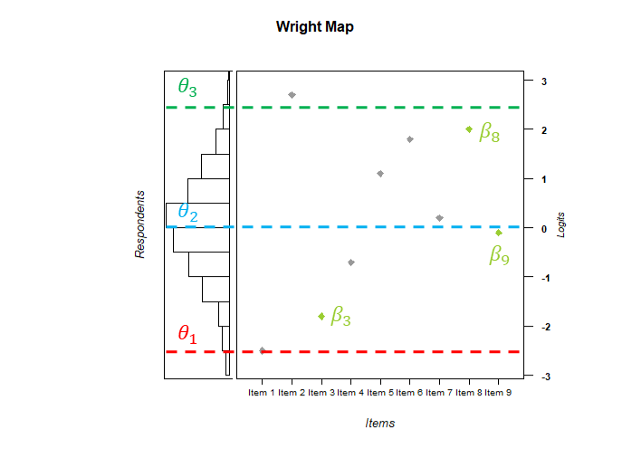{#fig-wright_map_example}

The core idea behind the Wright map is that it allows us to compare items and individuals very effectively and thus assess how well our test fits the sample we are using for measurement.
Let's take Person 1, for example, who has a very low score on the construct (see $\theta_1 = -2.5$); this could be a person with very low environmental concerns, in the case of the ECo scale.
We can see that virtually all items except Item 1 lie significantly above Person 1’s trait score (above the dashed red line).
If we now recall that the item difficulty $\beta_i$ corresponds to the $\theta$ score at which the probability of answering the item with a 1 is 50%, we can see here—even without looking at the exact ICC curves—that Person 1’s probability of answering the item with 1 for most items is well below 50%, meaning they will answer most items with a 0.
To put it simply, you could say that the scale is too difficult for Person 1.

For Person 3, it’s exactly the opposite.
This person has such a high construct score ($\theta_3 = 2.5$) that they score above all items except Item 2.
Accordingly, Person 3 also scores above the difficulty level of most items and therefore has a probability of answering correctly greater than 50% for most items.
This means that Person 3 is highly likely to answer most items with a 1.
Simply put, the scale is too easy for Person 3.

Person 2 is in the middle between the other two people and has a moderate construct score ($\theta_2 = 0$).
Here we see that some items lie below the blue line, meaning Person 1 has a greater than 50% probability of answering the item with a 1 (e.g., Item 3); some items lie above the blue line, meaning Person 1 has a less than 50% probability of answering the item with a 1 (e.g., Item 8); and some items lie very close to the blue line, in which case Person 1 has roughly a 50% probability of answering the item with a 1 (e.g., Item 9).
We can therefore see that this person will likely answer some items correctly but will fail to answer others.

For another illustrative example and intuitive introduction to the Wright Map see also @wilson2023.

To measure a construct accurately for an individual, it is best if the difficulty of an item corresponds to that individual’s level on the construct.
We’ll take a closer look at why this is the case later on ([see Section @sec-Information]).
It follows, then, that the item difficulties should cover the entire range of the construct we wish to measure [@debelak2022].
We can now check this very easily using the Wright Map [e.g., @debelak2022 Figure 4.1; @chen2026].
In our example, we see that the items are distributed across the entire length of the histogram.
This means we have items that not only measure exactly at the center of the distribution (e.g., Item 9) but also items that can measure exactly at the edges of the distribution (e.g., Item 3 and Item 8); thus, our scale covers the various construct levels $\theta$ that occur in our sample.

Another very useful application of the Wright map is that it allows us to link the construct map with the Wright map [@wilson2023].
As a quick reminder, the construct map defines different waypoints that map out the different levels of the construct we want to measure [(haben wir die construct map davor überhaupt schon eingeführt?)]{.mark}.
These can, for example, be used during item construction to create items that target different levels of the construct.
For instance, to develop a construct map for the construct of environmental concern, we have to ask ourselves what different levels of environmental concern look like.
The nice thing about IRT is that we model our construct as a latent variable.
Therefore, our item and person parameters ($\beta$ and $\theta$) can be placed on the same continuum as the waypoints of the construct map.
This allows us to check whether our newly created items really target the area of the continuum they were designed for (based on the waypoints of the construct map), or whether they are off for some reason.
Thus, we can use the Wright map to inspect the match between our theory-based intention (construct map) and the empirical evidence (item and person parameters based on the observed data) [@wilson2023, p. 148].
If the theoretical concept and the empirical evidence match, this is, of course, an indication that our measurement instrument is working as intended (though this does not replace a full-scale validation).
However, as @wilson2023 describes, discrepancies can also be very helpful in the process of developing the measurement instrument.
For example, if an item that was created to tap into the lower levels of the construct continuum has a much higher item difficulty $\beta_i$, placing it closer to a mid-level waypoint, we become aware that something is off.
Either we have to revise the item because it is not working as intended, or our conceptualization of the construct (i.e., the construct map) is wrong and we have to rethink our waypoints.
In this way, the Wright map can help us identify friction points early in the development process.
For further discussion of this point and some illustrative examples, see @wilson2023.

::: {.callout-note appearance="simple"}
## Let's do it in R

To create a Wright map in R we are using the `WrightMap` package [@torresirribarra].

Before we can create the Map itself we have to prepare the data.

```{r}
# load package

library(WrightMap)                                                          # <1>

# prepare data for wright map

theta <- fscores(eco_rasch, method = "EAP")[,1]                             # <2>
beta <- coef(eco_rasch, IRTpars = TRUE, simplify = TRUE)$items[, "b"]       # <3>

```

1.  First we have to load the package, so that we can use it in our R session.
    If you haven't installed the package yet, you can use this code: `install.packages("WrightMap")`

2.  Next we save the estimated person parameters ($\theta_n$) in an object we call "theta".
    We should already be familiar with this code from earlier, so it won't be explained in detail here.
    New is only the `[,1]` at the end of the syntax.
    Basically, this tells R to just take all rows but only column 1 from the `fscores()` object, because we are only interested in the values and not the person IDs.

3.  Here we save the item difficulties (\$\\beta_i\$) in an object we call "beta".
    Again, this code should be familiar.
    If you recall from above, `coef()` gives three section in its output.
    We are only interested in the itemparameters, therefore, we extract them by adding \$items to the code.
    In the case of the Rasch model we are only interested in the item difficulties, so we can ignore the other item specific parameters.
    To only extract the $\beta_i$ we add `[, "b"]` ("extract all rows but only the `b` column")

Now we can create the plot by using the `wrightMap()` function.

```{r}
#| results: hide
# plotting the Wright map

wm <- wrightMap(theta,                                    # <1>
                beta,                                     # <2>
                label.items = paste("Item", 1:9),         # <3>
                show.thr.lab = FALSE,                     # <4>
                item.side   = itemModern,                 # <5>
                main.title  = "Wright Map")               # <6>
```

1.  Here we pass in our person locations, or $\theta_n$

2.  Here we pass in our item locations or item difficulties, or $\beta_i$

3.  This is where the item names are defined.
    Since the names of our items in the ECo scale data are quite long, and to keep the plot clear, we'll use new item names here by simply numbering the items.
    However, you can also easily use the item names from the data by replacing `paste()` with `rownames(beta)`

4.  This argument is relevant for more complex IRT models and can be ignored in the case of the Rasch model; therefore, it is set to `FALSE` here.

5.  Here we can specify the plot's design.
    For the different themes available, see the function's documentation.

6.  Here we can give our plot a title.
:::

### Assumptions and Properties of the Rasch Model

#### Unidimensionality

So far, we have always assumed that there is exactly one parameter on the individual’s side that influences the probability that an item will be answered with a 1.
We can see this in the formula as well, since there is only one parameter, which has the individual-specific index $n$.
So far, we have always assumed that there is exactly one parameter on the individual’s side that influences the probability that an item will be answered with a 1.
We can see this in the formula as well, since there is only one parameter with the person-specific index $n$.
This implies that only the construct we refer to as $\theta$ (in our example, “environmental concerns”) influences the respondents’ answers to the items.
This assumption is called *unidimensionality assumption*.

#### Local independence

Another assumption, which is also closely related to the assumption of unidimensionality, is *local independence*, or sometimes also called *conditional independence*.
Local independence assumes, that the responses a person gives to the various items are independent of one another, conditional on the value of $\theta_n$.
This means that the only source of relationships between the item responses of a person can be the person-specific construct $\theta_n$.
This goes back to the assumption of unidimensionality, since we assume that there is only one person-specific construct that influences a person's responses to the items.
We can illustrate this using the ECo scale as an example.
We assume that the probability of a person agreeing with items designed to measure environmental concern depends solely on the level of that person’s environmental concern.
Accordingly, it makes sense that the responses a person gives to different items on the scale are correlated.
For example, a person with high levels of environmental concern will agree with most items, while a person with low levels of environmental concern will disagree with most items.
Consequently, a person’s responses are correlated because they are all based on the same level of environmental concern.
However, if you account for this source of commonality among a person’s item responses, then that person’s responses to the items should be independent—that is, random.

::: {.callout-tip appearance="simple"}
## Mathematical background

Mathematically, this can be expressed as follows [@lord1980, p. 19]:

$$P(Y_{ni} = 1| \theta_n) = P(Y_{ni} = 1|\theta, Y_{nj}, Y_{nk}, ...) \quad (i \neq j, k. ...)$$ {#eq-local_indi_1}

This means that the probability that person $n$ answers item $i$ with a 1, given $\theta$, is the same as the probability that person $n$ answers item $i$ with a 1, given $\theta$ and given person $n$’s answers to items $j$, $k$, and all other items that are not $i$.
Put simply, this means that the information about what the person said on the other items does not influence the answer to item $i$.

Another possible way to write this is [@lord1980, p. 19]:

$$P(Y_{ni} = 1, Y_{nj} = 1, Y_{nk} = 1| \theta_n) = P(Y_{ni} = 1|\theta_n) \cdot P(Y_{nj} = 1|\theta_n) \cdot P(Y_{nk} = 1|\theta_n)$$ {#eq-local_indi_2}

This expression states that the probability that a person answers all three items $i$, $j$, and $k$ with 1, given $\theta_n$, is equal to the product of the individual probabilities of answering an item with 1
:::

If the assumption of local independence is violated, this means that, in addition to the construct $\theta$ that we wish to measure, there are one or more other sources of systematic variance that influence individuals' response behavior.
These could be, for example, other latent constructs that also affect the response process.
For instance, in addition to environmental concerns, the need for cognitive closure might also influence item responses.
However, since we assume only a unidimensional structure, this additional construct is not represented in our model (Please note, that there are also multidimensional IRT models, however, this topic is beyond the scope of this tutorial).
It is however important to note that local stochastic independence should not be considered equivalent to the assumption of unidimensionality [@deayala2022, p. 22].
There may also be other sources of systematic variance.
For example, item order effects.
For instance, the response to a previous item could influence how one responds to a subsequent item.
This, too, would violate the assumption of local stochastic independence.
For an overview of other sources of local dependence see @yen1993

We can test whether the assumption of local stochastic independence holds for our model by using *Yen's* $Q_3$ [@yen1984].
This approach takes advantage of the fact that, under local stochastic independence, the only source of shared variance between items must be the latent trait, which we quantify with our $\theta$.
The idea, therefore, is that the residual of an item—that is, the portion of variance in our response data that cannot be explained by our Rasch model—is specific to that item.
This is because if the residual variances of different items are correlated, this suggests that there is a source of shared variance that has not been captured by our Rasch model.
That's what $Q_3$ does.
It calculates the residuals for all individuals on all items and correlates them for all possible item pairs.

::: {.callout-tip appearance="simple"}
## Mathematical background

Formally, in mathematical terms, this can also be expressed as follows [@yen1984; see also @christensen2017]:

The residual for the response of a person $n$ to item $i$ can be calculated as: $$d_{ni} = Y_{ni} - \hat{P}(Y_{ni} = 1| \hat{\theta}_n)$$ Here, $Y_{ni}$ is the actual response that person $n$ gave to item $i$ (0 or 1).
$\hat{P}(Y_{ni} = 1| \hat{\theta}_n)$ is the probability predicted by our Rasch model that person $n$ will choose response 1 for item $i$.
The hat symbol ($\hat{ }$) indicates that these are estimated model parameters based on the observed data.
We thus calculate the discrepancy between the person’s actual response and our model’s prediction.
The larger this discrepancy, the more our model has mispredicted, and the greater the proportion of variance in the participants’ responses that we cannot explain.
Consequently, we can then calculate the residue for person $n$ on item $j$ in the same way: $$d_{nj} = Y_{nj} - \hat{P}(Y_{nj} = 1| \hat{\theta}_n)$$ This allows us to calculate the residuals for each person on each item.
We can then use these residuals to calculate the correlation between the residuals of two items resulting in $Q_3$.
For example, we can calculate the correlation between the residuals of all persons on item $i$ (= $d_i$) and the residuals of all persons on item $j$ (= $d_j$) as follow: $$Q_{3,ij} = r_{d_i,d_j}$$
:::

So if local stochastic independence holds, we would expect the residual correlations of all possible item pairs to be close to 0.
Conversely, the larger the residual correlation becomes, the more shared variance there is between two items that cannot be explained by our Rasch model.
This raises the question of what level of residual variance—or $Q_3$—we should use as the criterion for concluding that local stochastic independence has been violated.
A common value often found in the literature is 0.2 [@nason2025].
This means that if $Q_3$ values are greater than 0.2, we would assume a violation of local stochastic independence.

::: {.callout-important appearance="simple"}
## Be careful

A rule of thumb is that when residual correlations are greater than 0.20, local stochastic independence is violated.
However, this is only a rule of thumb and not a 100% guarantee or proof that local stochastic independence holds [e.g., @nason2025].
For a more in-depth discussion of this topic, see [@christensen2017].
:::

:::: {.callout-note appearance="simple"}
## Let's do it in R

We can test whether the assumption of local stochastic independence holds for our model.
To do so, we use the Q3 approach proposed by Yen.

```{r}
#| output: false


eco_rasch_Q3 <- mirt::residuals(eco_rasch, type = "Q3")
```

To make the output clearer, we'll rename the row and column labels of the resulting matrix.

```{r}

row.names(eco_rasch_Q3) <- c(paste("Item", 1:9))
colnames(eco_rasch_Q3) <- c(paste("Item", 1:9))

eco_rasch_Q3

```

We can check whether the cutoff of 0.2 is exceeded in our matrix:

```{r}
# test if any residual correlation exceeds 0.2
any(eco_rasch_Q3 > 0.2 & eco_rasch_Q3 != 1)  # if TRUE local independence does not hold
```

::: column-margin
It is important to note that the correlation matrix containing the residual correlations also includes the correlations of the items with themselves (variance).
Logically, this value is always 1 in a correlation matrix, since an item is perfectly correlated with itself.
Since we are interested in comparing pairs of different items, the 0.2 criterion does not apply to the variances.
Accordingly, we must exclude these from the comparison; otherwise, all item variances would be flagged because they exceed 0.2.
We achieve this by adding the second logical condition `eco_rasch_Q3 !=1`.
This filters out all residual correlations that are greater than 0.2 but less than 1, since the `&`operator ensures that both logical statements must be true simultaneously for the result to be`TRUE\`.
:::

If the residual correlation of at leat one item pair exceeds 0.2 we can filter for all item pairs, which are violating the 0.2 cut off.

```{r}
# which item pairs are affected?
which(eco_rasch_Q3 > 0.2 & eco_rasch_Q3 != 1)
```

Note that in this case the output gives us `integer(0)` because no item pair violates the cutoff.
However, if any residual correlations exceed 0.2, the output consists of the positions of the correlations in the `eco_rasch_Q3` object.
If the output is, for example, 10, this means that the tenth residual correlation exceeds 0.2.
This corresponds to the item pair consisting of Item 1 and Item 2.
If the number of items is not too large, the results can also be presented as a matrix, making it easier to identify the item pairs:

```{r}
# overview in a matrix:
eco_rasch_Q3 > 0.2 & eco_rasch_Q3 != 1
```
::::

#### Sufficient statistic

A distinctive feature of the Rasch model is that the total score—that is, the number of items to which a person answered 1—is a sufficient statistic for $\theta$.
This means that if you know a person's total score, you also know $\theta$; in other words, the data does not provide any further information about $\theta$ beyond the total score, or, to put it another way, the total score contains all the information about $\theta$ that can be derived from the data [@lord1980, p.57].

So, if you want to estimate a person’s $\theta$, it is sufficient to know how many items a person answered with a 1 (= total score), and it is irrelevant which specific items a person answered with a 1.
This means that people who answered the same number of items with a 1 are estimated to have the same $\theta$.
This can lead to the paradoxical effect that a person who, for example, answered three easy items with a 1 is assigned the same $\theta$ as a person who answered three difficult items with a 1.

The same applies to item difficulty.
The number of people who answered an item with a 1 is a sufficient statistic for item difficulty.
Therefore, it is enough to know how many people answered an item with a 1, rather than which specific people answered it with a 1.

::: {.callout-important appearance="simple"}
## Be careful

The property of a sufficient statistic holds only as long as the assumptions of the Rasch model hold.
For other IRT models, the total score is not a sufficient statistic.
:::

::: {.callout-tip appearance="simple"}
## Mathematical background

To show that the total score is a sufficient statistic, we can first consider how the Rasch model can predict a person’s response vector.
This means that we want to predict which responses a person gave to the various items based on their $\theta$ value.
As we have learned, if the assumption of local stochastic independence holds, we can multiply the individual probabilities for each item response to obtain the probability of a person's overall response pattern across all items (see @eq-local_indi_2).
You can see that in the first line of @eq-proof_suff_1 (The equations were taken from @meiser2025).
If we rearrange the equation, we see that the number of items answered with 1 ($\sum_i x_i$), is included in the equation.
This corresponds to the true score, so we can also write $\sum_i x_i$ as $t$.

$$\begin{align}
P(X_1 = x_1, X_2 = x_2, ..., X_I = x_I|\theta) &= \prod_{i = 1}^I P(X_i = x_i |\theta) \\
&= \prod_{i = 1}^I \frac{\exp(x_i(\theta - \beta_i)}{1 + \exp(\theta - \beta_i)}\\
&= \frac{\prod_i \exp(x_i(\theta - \beta_i))}{\prod_i (1 + \exp(\theta - \beta_i))}\\
&= \frac{\exp[\sum_i (x_i(\theta - \beta_i))]}{\prod_i (1 + \exp(\theta - \beta_i))}\\
&= \frac{\exp[\sum_i x_i\theta - \sum_i x_i \beta_i]}{\prod_i (1 + \exp(\theta - \beta_i))}\\
&= \frac{\exp[t\theta - \sum_i x_i \beta_i]}{\prod_i (1 + \exp(\theta - \beta_i))} \quad \text{with} \quad t = \sum_i x_i
\end{align}$$ {#eq-proof_suff_1}

If the true score $t$ is known (we can count in the data how often a person responded with 1), we can rearrange the equation as follows:

$$\begin{align} P(X_1 = x_1, X_2 = x_2, ..., X_I = x_I|\theta, t) &= \frac{(\exp[t\theta - \sum_i x_i \beta_i])/(\prod_i (1 + \exp(\theta - \beta_i)))}{\sum_{X_t} (\exp[t\theta - \sum_i x_i \beta_i])/(\prod_i (1 + \exp(\theta - \beta_i)))}\\ &= \frac{\exp[t\theta - \sum_i x_i\beta_i]}{\sum_{X_t} \exp[t\theta - \sum_i x_i\beta_i]}\\ &= \frac{\exp(t\theta) \cdot \exp(-\sum_i x_i\beta_i)}{\sum_{X_t} \exp(t\theta) \cdot \exp(-\sum_i x_i\beta_i)}\\ &= \frac{\exp(-\sum_i x_i\beta_i)}{\sum_{X_t} \exp(-\sum_i x_i\beta_i)} \end{align}$$ {#eq-proof_suff_2}

What we can see from all these rearrangements is that if we include the total score $t$ in the equation, we can completely eliminate the parameter $\theta$.
Ultimately, we no longer need $\theta$ to predict a person’s response vector.
It is sufficient to know the total score $t$.
Therefore, the total score $t$ is a sufficient statistic.

@meiser2025[*-\>darfichdiezitieren????*]{.mark}
:::

#### Specific objectivity

The property of specific objectivity means that, when comparing individuals in terms of their $\theta$ values, it does not matter which item is used.
This means that a person who, for example, has higher levels of environmental concern will always be more likely to agree with an item that measures environmental concern than a person with lower levels of environmental concern, regardless of which item on the ECo scale is used as the basis for comparison.

Conversely, the comparison of items is independent of which individuals answered the item.
For example, a more difficult item always requires higher levels of environmental concerns than an easier item; or, to put it another way, a more difficult item is more difficult for all individuals than an easier item, regardless of the individual’s $\theta$ level.

That should sound familiar to us, because we've already seen this very characteristic in the ICCs.
We have already noted that, in the Rasch model, the ICCs all run parallel to one another and are shifted along the x-axis only according to their item difficulty [see Figure @fig-ICCEco_Rasch].
This parallelism satisfies the requirement for specific objectivity.
Thus, we can see that the higher a person’s $\theta$ is, the higher the probability of answering the item with a 1 ($P(Y_{ni} = 1)$), regardless of which item we are considering.
This is also evident in @fig-ICC_spec_obj_Rasch : Regardless of whether it is Item 1 or Item 2, the green person ($\theta = 2$) always has a higher probability of answering ($P(Y_{ni} = 1)$) (see the point of intersection with the y-axis) than the pink person ($\theta = -2$).

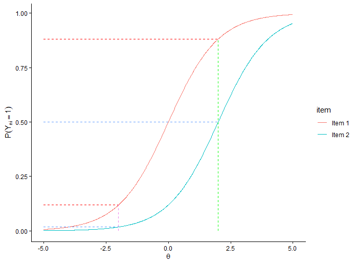{#fig-ICC_spec_obj_Rasch}

Conversely, we see that regardless of whether we consider the green person ($\theta = 2$) or the pink person ($\theta = -2$), both individuals have lower response probabilities on the more difficult Item 2 than on Item 1.
This is evident from the fact that the red horizontal dashed line for Item 1 for each person always lies above the blue horizontal dashed line for Item 2.

::: {.callout-important appearance="simple"}
## Be careful

The property of a specific objectivity holds only as long as the assumptions of the Rasch model hold.
Specific objectivity does not apply to other IRT models.
:::

However, as soon as the ICCs are no longer parallel, specific objectivity no longer applies, since it may then be the case, for example, that a person with a lower $\theta$ has a higher probability of answering an item with a 1 than a person with a higher $\theta$, while the opposite is true for another item as can be seen in @fig-ICC_spec_obj_2PL .
Here, the pink person ($\theta = -2$) is more likely to answer Item 2 with a 1 than Item 1.
For the blue person ($\theta = 2$), it is exactly the opposite.
So, here, for example, the probability of answering an item with a 1 is not always lower for a more difficult item (Item 2), as the pink person demonstrates.

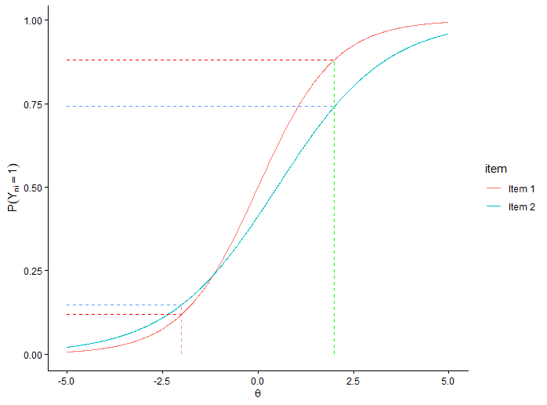{#fig-ICC_spec_obj_2PL}

::: {.callout-tip appearance="simple"}
## Mathematical background

It can also be shown mathematically that specific objectivity holds under the Rasch model, as demonstrated, for example, in @debelak2022 [p. 30] and below.

To illustrate this, let's imagine we want to compare two people, $n$ and $n^\prime$.
To do this, we can look at the difference in the probability that each person answers 1 to the item.
To calculate the probability that a person will answer the item with a 1, we can use the formula from the Rasch model:

$$P(Y_{ni} = 1) - P(Y_{n^\prime i} = 1) = \frac{\exp(\theta_n - \beta_i)}{1 + \exp(\theta_n - \beta_i)} - \frac{\exp(\theta_{n^\prime} - \beta_i)}{1 + \exp(\theta_{n^\prime} - \beta_i)}$$

However, if instead of calculating the probability that a person will answer the item with 1, we now want to calculate the log odds, then we can rewrite the formula for the Rasch model.
We have learned that we can also think of the Rasch model as a generalized linear model.
Therefore, if we apply the inverse of our link function to our dependent variable (the probability of answering an item with a 1), we obtain only the linear term ($\theta_n - \beta_i$) on the predictor side of the equation, and the dependent variable is transformed into the log odds.:

$$\log\left(\frac{P(Y_{ni} = 1)}{1 - P(Y_{ni} = 1)}\right) = \theta_n - \beta_i$$

If we now rewrite the comparison of the persons accordingly, we get:

$$\begin{aligned}
\log\left(\frac{P(Y_{ni} = 1)}{1 - P(Y_{ni} = 1)}\right) - \log\left(\frac{P(Y_{n^\prime i} = 1)}{1 - P(Y_{n^\prime i} = 1)}\right) &= (\theta_n - \beta_i) - (\theta_{n^\prime} - \beta_i)\\
&= \theta_n - \beta_i - \theta_{n^\prime} +  \beta_i\\
&= \theta_n - \theta_{n^\prime} +  \beta_i - \beta_i\\
&= \theta_n - \theta_{n^\prime}
\end{aligned}$$

As you can see, in the end, only the comparison of $\theta$ remains, and the item parameters cancel out.
This means that when comparing two individuals, $n$ and $n^\prime$, it does not matter on which items the two individuals are compared.
This corresponds to the definition of specific objectivity.

The same can be shown for the comparison of two items, $i$ and $i^\prime$:

$$\begin{aligned}
\log\left(\frac{P(Y_{ni} = 1)}{1 - P(Y_{ni} = 1)}\right) - \log\left(\frac{P(Y_{ni^\prime} = 1)}{1 - P(Y_{ni^\prime} = 1)}\right) &= (\theta_n - \beta_i) - (\theta_{n} - \beta_{i^\prime})\\
&= \theta_n - \beta_i - \theta_n +  \beta_{i^\prime}\\
&= \theta_n - \theta_n + \beta_{i^\prime} - \beta_i\\
&= \beta_{i^\prime} - \beta_i
\end{aligned}$$

Here, too, we see that when comparing items, the person-specific parameters cancel each other out.
Therefore, when comparing two items, $i$ and $i^\prime$, it does not matter which individuals answered the two items.
This, too, is consistent with the definition of specific objectivity.
:::

Ultimately, specific objectivity is related to a form of fairness, since it requires that a comparison is based solely on the the latent construct ($\theta$) and does not depend on the items used to measure the construct [@debelak2022, p. 28].
With regard to test development, it is also important that the comparison of different items not depend on who answers them.
This, too, ensures a specific level of objectivity.With regard to test development, it is also important that the comparison of different items not depend on who answers them.
This, too, ensures a specific level of objectivity [see @rasch1961, p. 332; @wilson2023, p. 248].

- *These properties are based on some assumptions which can be tested to check if the Rasch model holds*

### Identifiability

Although the exact estimation procedures for fitting a Rasch model to the data are not covered in detail in this tutorial, it is important to note at this point that the Rasch model has an identifiability problem.
This is due, on the one hand, to the fact that the scale on which we locate $\theta$ and $\beta$ is a latent scale, since we are, after all, modeling latent constructs.
Since latent constructs are abstract and cannot be directly observed, they do not have a natural unit or metric.
And second, it is solely the difference/distance between $\theta_n$ and $\beta_i$ that determines the probability that the item will be answered with a 1.
However, this also means that, in theory, there are an infinite number of $\theta$ and $\beta$ combinations that can produce the same response probability.
For example, the probability that a person will answer an item with a 1 is the same for a person with $\theta = 4$ and $\beta = 2$ ($\theta - \beta = 4 - 2 = 2$) as for a person with $\theta = 6$ and $\beta = 4$ ($\theta - \beta = 6 - 4 = 2$) or for any other $\theta$ and $\beta$ combination, which produces a difference of two.
If the Rasch model now attempts to estimate $\theta$ and $\beta$ based on the data, the model cannot find a unique solution, since there are theoretically an infinite number of combinations that are equally likely for the data.
This is also referred to as the identifiability problem; in other words, the model is said to be unidentifiable [see also @deayala2022, p. 44].

To solve this problem, we must ensure that our latent continuum has a unique origin and metric.
The unit of measurement in the Rasch model is set to 1, so we only need to specify the origin of the metric [@deayala2022*, p. 44*].
There are various ways to do this, known as restrictions (since the possible solutions for the model are restricted in order to ensure a unique solution).

- **sum norm restriction (item centering):** The idea here is that we give the model an additional “rule”: it should estimate the item difficulties $\beta$ such that the sum of the item difficulties equals 0 ($\sum_{i = 1}^I \beta_i = 0$).
  Simply put: Because the model now not only seeks the parameters most likely to predict the data but must also satisfy the new rule, there are no longer an infinite number of possible solutions, and the model becomes identifiable.

- **fix the difficulty of one item (anchor item):** The idea here is that we set the item difficulty $\beta_i$ of a given item to a specific value (usually $\beta_i = 0$).
  The logic here is that the items differ in their $\beta$ relative to one another.
  By fixing a $\beta_i$ (also known as “setting it”) and requiring the remaining items to maintain a certain distance from that item in order to reflect the relative distances, we obtain unique solutions.
  To put it simply, you can think of it this way: We know that Item 2 is two units more difficult than Item 1, and Item 3 is one unit easier than Item 1.
  Without any restrictions, there would now be an infinite number of possible $\beta$ values for these items, e.g., $\beta_1 = 2$, $\beta_2 = 4$, and $\beta_3 = 1$, or $\beta_1 = 10$, $\beta_2 = 12$, and $\beta_3 = 9$.
  However, if we now introduce a restriction and define that $\beta_1 = 0$ (fixing it), then there is only one solution for the other $\beta$ values that correctly represents the relative distances between the items, namely $\beta_2 = 2$ and $\beta_3 = -1$.

- **set expected value of person trait to 0 (person centering):** This is a similar idea to the sum norm restriction.
  We tell the model to estimate the $\theta$ values so that they predict the data as well as possible, but also so that the mean of the estimated $\theta$ values is 0.

Since the person parameters ($\theta$) and item parameters ($\beta$) lie on the same latent scale, it is sufficient to apply one of the restrictions mentioned to specify the origin of the metric [@deayala2022, p. 44].

### Information {#sec-Information}

#### Item information

A key concept in IRT that is very helpful for test development—and one that does not exist in this form in CTT—is item information.
One can think of information as a measure of measurement accuracy or precision.
One can understand this quite intuitively if one take a closer look at the ICC of an item.

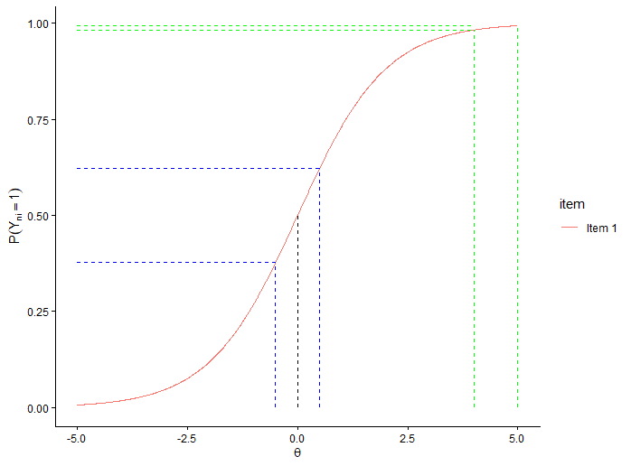{#fig-example_ICC_info}

The ICC plots the different $\theta$ values on the x-axis and the probability to respond to the item with a 1 on the y-axis.
We can see that the Function follows a S-shaped curve.
Therefore, the slope of the function is not constant—as it is, for example, in a linear function—but varies depending on the point on the x-axis.
Consequently, we can see that the change in the probability to respond to the item with a 1 (y-axsis) is different depending on the $\theta$-area on the continuum.

For example for persons with very high $\theta$-values (or very low) the probability doesn't really change if the $\theta$ increases or decreases.
We can see this in @fig-example_ICC_info.
The two green persons have rather high $\theta$ values ($\theta_{\text{green1}} = 4$ and $\theta_{\text{green2}} = 5$).
Although person green2 has a $\theta$ value that is one unit larger, we can see on the y-axis that the probability that the individuals will answer 1 to the item barely differs ($P(Y_{\text{green1}i} =1) = 0.98$ and $P(Y_{\text{green2}i} = 1) = 0.99$).
This is because, in the low and high $\theta$ ranges, the slope of the item function/ICC is quite flat.
This means that changes along the x-axis are hardly reflected in changes along the y-axis.

The situation is different when we consider the $\theta$ range around the item difficulty (here, $\theta_i = 0$).
Here, we see that the slope of the ICC is quite steep compared to the extremes.
Let's take a look at the two blue persons ($\theta_{\text{blue1}} = -0.5$ and $\theta_{\text{blue2}} = 0.5$) in @fig-example_ICC_info .
These two people differ by exactly one $\theta$ unit, just like the two green people.
However, we see here that this $\theta$ difference between the blue people makes a big difference in the probability that the person will answer the item with a 1.
Person “blue” has a 38% probability of answering the item with a 1, while person “blue2” has a 62% probability.
Put simply, one could say that person ‘blue2’ is unlikely to agree with the item, while person “blue” is likely to agree with it.

So we see that the steeper the slope, the more differences in $\theta$ also make a difference in the response probability.
That’s why we can also say that the steeper the slope, the better we can distinguish or differentiate between individuals, even if they have very similar $\theta$ values.
We therefore “learn” the most about the $\theta$ values of individuals in those ranges of the $\theta$ continuum (x-axis) where the slope of the ICC is steep.
In other words, these ranges contain the most *information*.
Therefore item information shows us which areas of the $\theta$ continuum an item can capture especially well (in the sense of where it can differentiate between persons with $\theta$ values close to each other).

With this intuitive and visual introduction to the concept of information, it should now be clear that item information is related to the slope of the ICC.
The ICC reaches its steepest slope at the inflection point; accordingly, most of an item’s information is concentrated around the item difficulty, since we have learned that the item difficulty ($\beta$) marks the inflection point of the ICC.

::: {.callout-tip appearance="simple"}
## Mathematical background

Mathematically the Iteminformation for a certain $\theta$ value $I_i(\theta)$ for the Rasch model can be calculated by the probability to solve the item $p(X_i = 1)$ times the probability to not solve the item $p(X_i = 0)$ [@debelak2022, p. 51; @raschmo1995, p.55]:

$$\begin{align}
I_i(\theta) = p(X_i = 1|\theta_n,\beta_i) \cdot p(X_i = 0| \theta_n,\beta_i)
= \frac{exp(\theta - \beta_i)}{1 + exp(\theta - \beta_i)} \cdot \frac{1}{1 + exp(\theta - \beta_i)}
\end{align}$$ {#eq-iteminfo}
:::

If we theoretically calculate for every possible $\theta$ value the Information $I_i(\theta)$ (see @eq-iteminfo) and plotting the $\theta$s on the x-axis and the Iteminformation on the y-axis, then we get the *Item-Information curve* (see @fig-example_ICC_info for an example) .

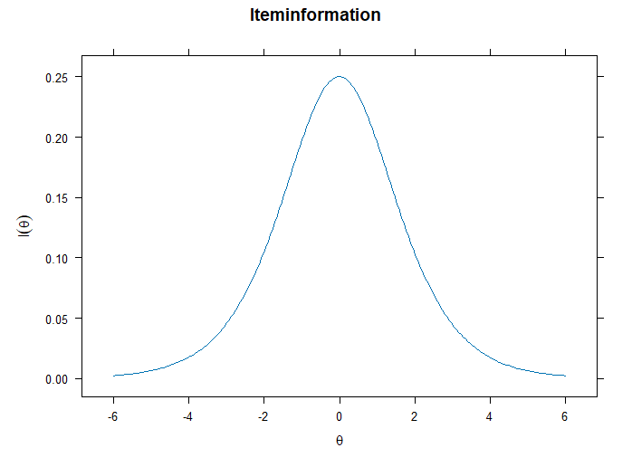{#fig-example_item_info}

This is quite usefull because we can visually see where on the $\theta$ continuum the item is especially informative or which part on the $\theta$ continuum the item measures especially precise.
Since we have already determined that the item information is greatest at the point of item difficulty (because that is where the ICC slope is steepest) and we know that the probability of a correct response at the point of item difficulty is 50% (because that is how item difficulty is defined), we can say that the maximum possible information in the Rasch Model is 0.25 (because $I_i(\theta = \beta_i) = 0.5 \cdot 0.5 = 0.25$) and lies at the point of item difficulty.
Therefore, the peak of the item information curve always corresponds to the item's difficulty level

The concept of item information as a measure of the (in)accuracy with which an item measures differs from CTT, and this is one advantage of IRT over CTT.
This is, because in the CTT we have reliability as a measure of precision.
However in CTT the reliability of an item is the same across the whole $\theta$ continuum.
This implies that an item can measure at every $\theta$ level equally well.
However this is rather unrealistic: for example consider an easy math item.
This item is challenging for persons with low math ability and not everyone will solve it, so we can differentiate between people at the lower end of the math ability continuum.
However the same item is easy for persons with a high math ability.
So every person with high math ability will solve this item.
However if we compare only people who are good in math an easy item doesn't differentiate between those people because every person can solve the item.
However, the CTT's reliability concept would suggest that a simple math item measures people with high math ability just as well as it does for people with low math ability.
In IRT, this is viewed more realistically based on item information, since each item can only accurately measure certain areas of a construct.
Put differently, in IRT the reliability varies over $\theta$ [@hoffman2024].

[*Hab hier das Mathe-Beispiel beibehalten, weil ich es intuitiver finde als das mit environmetal concerns zu erklären*]{.mark}

#### Test information

Most of the time we don't have a single item but a whole scale consisting of multiple items.
Since we learned that the item information is the largest around the item difficulty and the difficulty may vary from item to item, we could ask our self how the scale as a whole can differentiate between persons across the whole $\theta$ continuum.
One metric that reflects this is the test information.

Since each item contributes some information, we can calculate the total test information by summing up the item information of all items [@deayala2022, p.31].
Formally, this can be expressed as follows:

$$I(\theta) = \sum_{i=0}^I I_i(\theta)$$ {#eq-testinfo}

If we calculate the test information for every possible $\theta$ value with @eq-iteminfo and plotting the $\theta$ on the x-axis and the test information on the y-axis, then we get the *Test-Information curve* (see @fig-example_ICC_test_info for an example) .

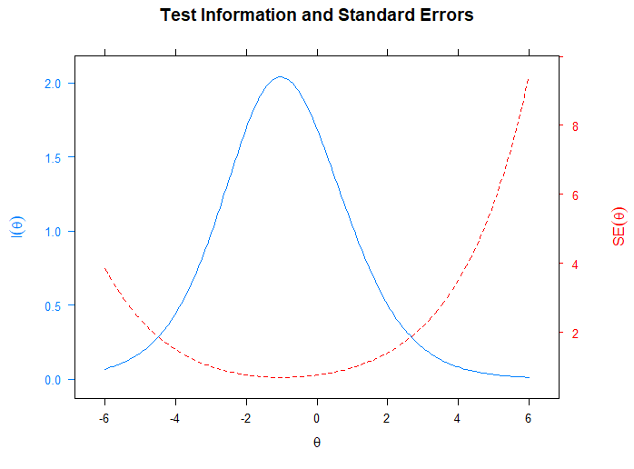{#fig-example_ICC_test_info}

Information is a measure of precision, and accordingly, it is also related to measures of imprecision.
Therefore, the test information is also related to the standard error.
Formally, this can be expressed as follows [@hoffman2024; @meiser2025; @deayala2022, p. 31]:

$$\text{SE}(\theta) = \frac{1}{\sqrt{I(\theta)}} = \frac{1}{\sqrt{\sum_{i=0}^I I_i(\theta)}}$$

This also makes intuitive sense, as we can see in the example @fig-example_ICC_test_info : At the $\theta$ areas where we measure very precisely (a lot of test information), we logically measure with less uncertainty (smaller standard error), and vice versa.

The Test information again demonstrates an interesting difference to CTT: In CTT, reliability always depends on the exact composition of the scale.
The contribution of an item to reliability/validity always depends on which other items it is measured alongside [@lord1980, p. 22].
In IRT on the other side, the information contribution of an item is independent of the other items included in the scale.
Despite these differences between CTT and IRT, the test information can also be converted into a reliability metric [@hoffman2024, p. 41]:

$$\text{Reliability} = \frac{I(\theta)}{I(\theta) + 1}$$

For a more formal derivation of the reliability formula see [@lord1980, p. 52].
However, it is important to note that this reliability measure is again $\theta$-specific, since the test information is $\theta$-specific.
To obtain a measure of overall model-based reliability, one could sum the reliabilities for each possible $\theta$ value and weight them by the number of individuals at that $\theta$ level [@hoffman2024].
@hoffman2024, however, questions the value of such an approach, since it negates the very advantage that an IRT-based perspective provides [see also @lord1980].

#### Practical use of information

Item and test information can be very useful and insightful for diagnosticians and in scale development, as it allows us to assess at a glance how well—and in which areas—our items or scale are able to estimate the latent construct $\theta$ [see also @deayala2022 for an illustration of this point].
We can understand this by looking at the fictional example shown in the @fig-usecase_info .
Here we have a scale consisting of 5 items, for which we know the item difficulties: $\beta_1 = 0$, $\beta_2 = 1$, $\beta_3 = 3.5$, $\beta_4 = -1.5$ and $\beta_5 = -3.5$.
This allows us to determine and plot the item information and test information for all possible values of $\theta$.
As we've learned, an item can best differentiate between individuals within the area around its item difficulty, and therefore most of the information about that item is also found within that same area.
We can see this clearly in the figure.
Take, for example, item 5, which can be described as an easy item because it has a very low $\beta$.
Accordingly, we can see in the pink item information curve for this item that the peak of the curve (i.e., the most information) occurs at the item difficulty $\beta_5 = -3.5$ and then decreases toward the sides.
We can now clearly see that Item 5 is well-suited for assessing individuals with a low $\theta$ around -3.5, but that this item provides us with hardly any information about individuals with high $\theta$ values.
For example, the item information for Item 5 is effectively 0 for a person with $\theta_n = 2.5$.
In other words, Item 5 contributes nothing to our knowledge about a person with $\theta_n = 2.5$.

For Item 3, the exact opposite is true.
This item is a difficult item ($\beta_3 = 3.5$) and is therefore particularly effective at distinguishing between high $\theta$ scores.
So if we want to measure individuals with high $\theta$ scores, Item 3 is the better choice than Item 5.
However, this comes at the cost of Item 3 not being suitable for measuring individuals with low $\theta$ scores, as we can see from the very flat item information curve in low $\theta$ areas.

Fortunately, we usually don't measure a latent construct using just a single item, but rather use a scale based on multiple items.
Fortunately, we usually do not measure a latent construct using just a single item, but rather use a scale based on multiple items.
Therefore, we do not need to find a single item that can measure all $\theta$ ranges simultaneously with a high level of information (which is an unrealistic assumption).
Instead, we can consider the purpose for which we want to develop our measurement instrument.
For example, suppose we want to develop a measurement instrument that can be used for the general population.
For many constructs, it is assumed that they are normally distributed within the population.
This means that most individuals tend to have average scores on the construct (medium $\theta$ scores), but there are also some individuals with scores well above and well below average (low and high $\theta$ scores).
Therefore, our instrument must be capable of covering a broad $\theta$ continuum.
The five items on our scale would serve as a good measurement tool for this purpose, since we can see in the plot that the item information curves actually cover the entire relevant $\theta$ scale (from -5 to 5), as the scale contains items with very different $\beta$ values.
The black test information curve also summarizes this well.
Here we see that, overall, the scale has the most information around $\theta = 0$ and that the information decreases toward the sides.
Thus, the shape of the test information curve also resembles the distribution we assume in our population (normal distribution).
Of course, it should be noted here that this is an ideal example based on simulated data.

Therefore let's consider another scenario.
Let's imagine we want to develop a measurement tool designed exclusively for people with high $\theta$ values.
This could be, for example, an intelligence test specifically for highly gifted individuals.
For such a scenario, the fictitious scale from our example is not optimal.
For example, items 5, 4, and 1 contribute very little to the estimation of $\theta$ in our target continuum range.
In fact, only item 3 differentiates particularly well in high $\theta$ areas.
The test information curve also drops quite steeply starting at $\theta = 2.5$.
So we would actually need additional items with high item difficulty (high $\beta$) to obtain more information in the high $\theta$ ranges.
In return, we could eliminate items that provide information for $\theta$ ranges that do not actually interest us (such as items 5, 4, and 1).
Therefore, as @hoffman2024 notes, there is no universally “ideal” test information curve, since the optimal test information curve always depends on the purpose for which the measuring instrument was designed.

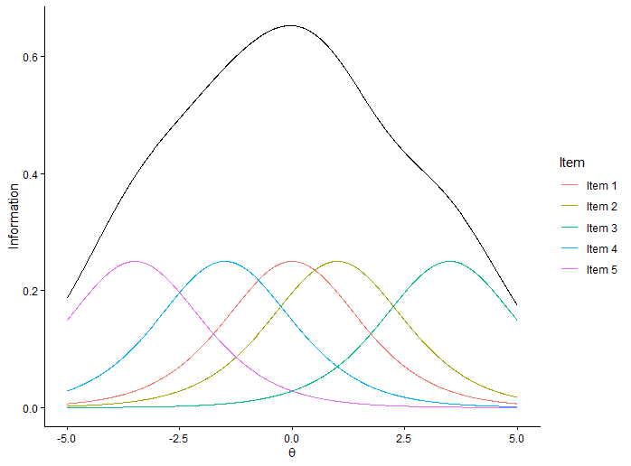{#fig-usecase_info}

These examples should highlight the advantage of IRT over CTT.
Because the item and respondent parameters are located on the same latent scale and we can determine the information from an item differentiated according to the $\theta$ values, we get a much more nuanced picture of our measurement tool and for whom it works particularly well.
From a scale development perspective we can adapt the design of our measurement instrument in a highly individualized and flexible manner to the specific requirements of the measurement situation [@deayala2022, p. 35].

Thus, IRT can be used to:

- optimize existing scales: e.g. by "filling" the information gaps by adding new items, which are informative for a specific $\theta$ range.
  Here, too, the ECo Scale is a good example.
  In fact, optimizing the measurement was one of the motivations behind the development of the ECo Scale, since analyses of existing measurement instruments for environmental concerns had shown that these provided little information in areas of high environmental concern [@gomm2026, Figure 1 and Figure 2].

- create short versions of scales without a substantial loss of information: e.g. we might see in the item information plot that the information curves for two items overlap significantly.
  Therefore, we can omit one of the items, since the $\theta$ range is already covered.

- develop measurement instruments specifically tailored to a particular situation or target population.
  To this end, Lord also suggests using a target information curve [@lord1980, p.23]: To do this, you need an item pool for which you already know the item information curves.
  You also need to consider the test information curve you want to achieve with your scale (e.g., a curve focused on a specific $\theta$ range or a curve that covers a broad continuum).
  This desired curve is the target information curve.
  You can then begin selecting items from the item pool that can fill the area under the target information curve.
  To do this, after each step, you calculate the test information curve obtained from the selected items and compare it with the target curve.
  In the next step, you then try to select a new item that brings you even closer to the target curve.
  For example, if one observes that the current items only cover the low $\theta$ range well, but high $\theta$ values should also be differentiated below the target information curve, then one could add a difficult item (high $\beta$) in the next step to fill this “gap” relative to the target information curve.
  This process is repeated iteratively until a scale has been composed that comes as close as possible to the target information curve.

::: {.callout-note appearance="simple"}
## Let's do it in R

To plot the item information, we can use the functions we're already familiar with from the ICCs: With `itemplot()`, we get the information curve for a specific item, while with `plot()` we can plot the information curves for all items together in a single plot.
What's new here is that we're selecting a different option in the `type` argument.
Instead of “trace” for the ICC, we're now selecting ‘info’ (for the `itemplot()` function) or “infotrace” (for the `plot()` function) to plot the item information.

```{r}
# plot item information curve of a specific item
itemplot(eco_rasch,6, type='info')

# plot all item information curves in a grid
plot(eco_rasch, type="infotrace", theta_lim=c(-5,5), facet = TRUE)

# plot all item information curves in a single plot
plot(eco_rasch, type="infotrace", theta_lim=c(-5,5), facet = FALSE)
```

To plot the test information curve, we can also use the `plot()` function:

```{r}
# plot test information curve
plot(eco_rasch, type="info")
```

We can also combine different types of information.
To do this, we can look at the various options offered by `type`.
For example, we can use “infoSE” to plot both the information curve and the standard error, or use “infotrace” to plot both the information and the ICC.

```{r}
# plot test information curve with SE
plot(eco_rasch, type="infoSE")

# plot item information curve of a specific item together with ICC
itemplot(eco_rasch,6, type='infotrace')
```
:::

- @hoffman2024 : "Because the loadings/slopes relate nonlinearly to theta, this implies that reliability (now called “test information”) must vary across theta values. So items are not just “good” or “bad”, but are “good” or “bad” for whom?"

- Therefore if we just look at the probability to solve the item, we can not really predict the exact $\theta$ value, if the probability is low (high), because multiple different $\theta$ values produce similar low (high) probabilities

- One can understand this quite intuitively if one take a closer look at the ICC of an item

  - An even more intuitive example:

    - If we have an item with medium item difficulty (e.g., a moderately difficult math question), then when comparing two highly capable individuals, the probability of solving it doesn’t really matter, since both will almost certainly solve the item because they are significantly more capable than the item’s difficulty level.
      The same applies to people who are bad at math.
      For them, the item is far too difficult, and they will almost certainly be unable to answer it.
      Although these individuals have different theta values, there will be no difference in their responses to the item.

    - Conversely, let’s imagine two people who are moderately good at math.
      If one person is able to solve the item and the other isn’t, this seems to indicate that the one person is slightly better at math than the other.

    - In the second case, the item thus reveals differences between individuals, and we can learn something about them.
      Therefore, the item is more “informative” in this case.

  - More mathematically formal explanation -\> <mark> should this be included?`<`{=html}
    `/mark>`{=html}

    - Understanding information through the second derivative *-\> could be more intuitive because it can be displayed visually and linked to the slope-logic*

    - Understanding information through the standard error (s. [@deayala2022, p. 29])

- Example with Information curves and interpretation, what we can learn about the scale

  - For example s. [@deayala2022, p. 32 ff.]
  - see also Hoffman lectures Lecture 5a

- Nützlich für Testkonstruktion (s. [@lord1980, p. 23])

  - auch noch auf Zusammenhang mit der Wright Map eingehen

    - ähnliche Idee aber hier noch zweite Dimension durch Testinformation

## 2PL

In the Rasch model we basically make the assumption, that all differences between responses can be explained by the discrepancy between the person parameter $\theta$ and the item difficulty $\beta$.
In a regression logic this discrepancy is our only predictor, to predict the responses of a person on an item.

But maybe this assumption, that only the person parameter and the item difficulty are influencing the response probability are a little bit harsh.
Maybe there are other predictors which also influence the response probabilities.
For example a further predictor could be the ability of an item to "differentiate among individuals located a different points on the continuum" [@deayala2022, p.137].
This is also called *discrimination.* From the Rasch model we are already familiar with this idea and know that this has something to do with the slope of the ICC.
However, in the Rasch model the slopes of the different items were all fixed at 1, which results in parallel ICCs.
This means that all items differentiated to the same degree between persons.
The only difference was where on the $\theta$ continuum they differentiated but they all differentiated equally "strong".
If we relax this assumption, we can now allow that different items can differentiate to varying degrees.
Therefore, we get a new property of the items, which we can use as a predictor to predict the response probability of a person on an item.

By adding this new item property to our prediction framework, we now have two item parameters in our model (item difficulty & discrimination).
This is an extention to the Rasch model, which has only 1 Parameter (1PL).
Therefore this new extension is called (Birnbaum) two-parameter logistic model (2PL).

### Model formula

The formula of the 2PL looks pretty similar to the Rasch-model.

$$P(Y_{ni} = 1) = \frac{\exp(\alpha_i(\theta_n - \beta_i))}{1 + \exp(\alpha_i(\theta_n - \beta_i))}$$

Let’s take a look at the individual components to better understand the formula:

On the left side of the equation is agian the probability that a person $n$ will answer item $i$ with a 1 ($P(Y_{ni} = 1)$).
Thus, $Y_{ni}$ denotes the response of person $n$ to item $i$ .
As the Rasch model the 2PL also assumes dichotomouse response data, so $Y_{ni}$ can take the values 0 or 1.
To predict this probability $P(Y_{ni} = 1)$ we again use the person parameter $\theta_n$ and the item difficulty $\beta_i$.
New is now the additional parameter $\alpha_i$, which represents the item discrimination.
Note that the item discrimination parameter is item specific, as we can see by the index $i$ of the $\alpha$ parameter.
This means that each item can have a different $\alpha_i$ value.

Here we can also see that the Rasch model is a special case of the 2PL where the item discrimination of every item is 1.
Formally speaking:

$$\alpha_i = 1 \quad \forall\, i \in \{1, \dots, I\}$$

We can also see this in the Output of the Rasch model (@lst-rasch-item-param).
The `a` column reflects the $\alpha_i$ values and as we can see are all at 1 in the Rasch model.

### Interpretation of the item discrimination parameter

If we ignore the link-function for a moment, which is there solely to ensure that our model outputs values in the interval of \[0;1\] to ensure a metric compatible with probabilities, than we are left with a linear term.
If we rewrite the formula we can see that this is basically a linear regression [@debelak2022]:

$$\alpha_i(\theta_n - \beta_i) = \alpha_i\theta_n - \alpha_i\beta_i$$

If we define a new variable $\gamma_i = -\alpha_i\beta_i$ than we can write:

$$\alpha_i\theta_n + \gamma_i$$

Now we can see that this looks like a simple linear regression, where $\theta_n$ is the predictor and $\gamma_i$ is the intercept.
More importantly, we can now see that the new item discrimination parameter $\alpha_i$ works as the slope of the function.

We can also see this in the ICCs of a 2PL model.

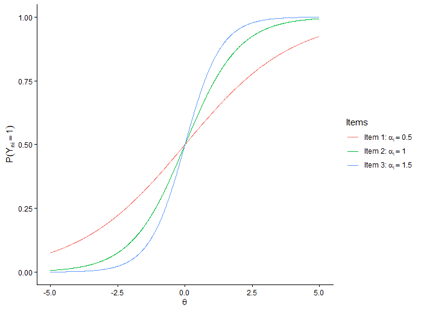{#fig-2PL-ICC-example-alphas}

As one can see, the more the $\alpha_i$ parameter increases, the steeper is the slope of the ICC around the item difficulty $\beta_i$.
The other way around, the smaller the $\alpha_i$ parameter get's the flatter the ICC becomes.

But how can we interpret the $\alpha_i$ parameter in terms of its meaning?
We already learned that the $\alpha_i$ parameter is also called item discrimination.
So what does discrimination actually mean?

Technically we know this already from the of the Rasch model (see @sec-Information).
There we learned that the steeper the slope of the ICC the better we can differentiate between two persons with $\theta_n$ values close to each other.
We also learned that an item can differentiate the best around the item difficulty $\beta_i$ because there lies the point of infliction and the slope of the ICC is the steepest.
But we've always illustrated this using just a single item (with an $\alpha_i = 1$).
So let's now consider what happens when items differ in their slope.

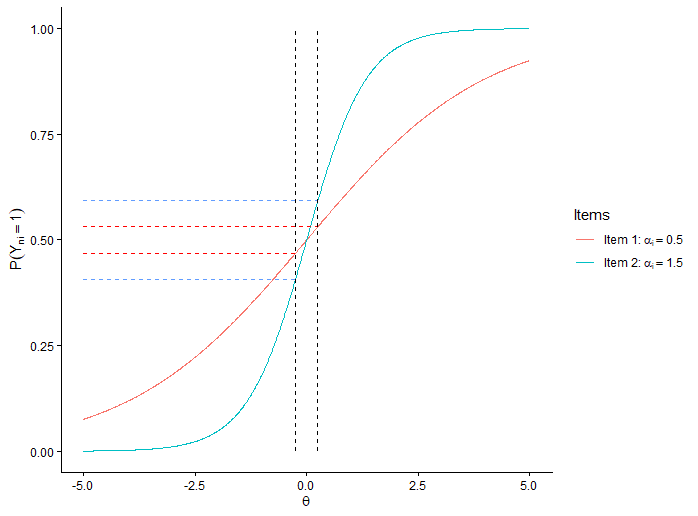{#fig-2PL-expl-discr}

In @fig-2PL-expl-discr we can see two different items with different $\alpha_i$ parameters but the same item difficulty $\beta_1 = \beta_2 = 0$.
Now imagin we have two Persons with very similar $\theta_n$ values, e.g. two persons with a similar amount of environmental concerns.
Lets say Person 1 has a $\theta_1 = -0.25$ and Person 2 has a $\theta_2 = 0.25$.
Both persons, therefore, fall within a range close to the difficulty levels of the two items—that is, a range in which the two items can best distinguish between persons.
So even though the two persons are located in the optimal $\theta$ range for both items, we can see that Item 2 is significantly better at distinguishing between the two persons than Item 1.
This is because Item 2 has a much steeper slope around the item difficulty than Item 1.
This results in lager differences in the model implied probabilities, that the person will answer the item with a 1, between the persons.
This we can see on the dashed lines in @fig-2PL-expl-discr.
The blue dashed lines are further apart from each other than the red ones.
A larger difference in the probabilities of answering the item with a 1 results in a clearer response pattern, in the sense that the respondents’ answers are more likely to differ.
The probability that Person 2 will answer with a 1 and Person 1 will answer with a 0 is greater for Item 2 than for Item 1.
If the two individuals’ answers differ, we can learn more about the individual or distinguish them more clearly.
Therefore, Item 2 has better discriminative power and we learned that "the magnitude of the difference in these predicted probabilities is a direct function of the item's $\alpha$" [@deayala2022, p. 20].

::: {.callout-tip appearance="simple"}
## Mathematical background

Note that the discrimination parameter of the IRT relates also to the item-total correlation from the CTT, which is also sometimes called item discrimination [@lord1980, p33]:

$$\alpha_i \approx \frac{\rho_{ix}}{\sqrt{1-\rho_{ix}^2}} \quad ; \quad
\rho_{ix} \approx \frac{\alpha_i}{\sqrt{1+\alpha_i^2}}$$

However, this mathematical relationship holds only if $\theta$ is restricted to a standard normal distribution and there is no guessing involved [@lord1980].
:::

::: {.callout-note appearance="simple"}
## Let's do it in R

To estimate the 2PL model we can also use the `mirt` package [@chalmers2012] and very similar syntax as with the Rasch model.

```{r}
# estimate a 2PL model:

eco_2PL <-  mirt(dat_eco_dicho[12:20], 
                 1, 
                 itemtype = "2PL",      # <1>
                 SE = TRUE)
```

1.  To estimate the 2PL model we can use the same code as for the Rasch model and just change the value in the `itemtype` argument from "Rasch" to "2PL".

We can use the `print()` function again to get a summary and some general informations about our 2PL model with regard to the estimation procedure and the overall model fit.

```{r}
# get general estimation and fit information about our model:

print(eco_2PL)
```

A detailed description of how to interpret this output was already covered in the Rasch section of the tutorial and can be found there (@lst-print-rasch).

Again we can also do a quick check of convergence by using the `converged` and `secondordertest` variables from our `mirt` object:

```{r}
# is the estimation algorith converged?
eco_2PL@OptimInfo$converged

# has the estimation algorith found plausible Maximum/Minimum
eco_2PL@OptimInfo$secondordertest
```

To inspect the item parameters we use the `coef()` function, as in the Rasch model

```{r}
# extract the itemspecific parameters from our 2PL model

item_par_eco_2PL <- coef(eco_2PL, IRTpars=TRUE, simplify=TRUE)

item_par_eco_2PL
```

The output consists of the three sections we are already familiar with.
Not that in contrast to the output of the Rasch model, her we have now `a` values, which differ from 1.
This is because the `a` column in the `$items` section contains our $\alpha_i$ parameters.

To extract the person parameters ($\theta_n$) we can use the `fscore()` function.
Note, that to keep the output short, we are only printing the first 6 person parameters to the console by using `head()` .

```{r}
# extract the personspecific parameters from our Rasch model
person_par_eco_2PL <- fscores(eco_2PL)

head(person_par_eco_2PL)
```

We've also learned that IRT models are related to exploratory factor analysis.
[Wurde das schon eingeführt oben?]{.mark}
Accordingly we can transform our IRT model parameters into standardized factor loadings.
To do this, we use the `summary()` function.

```{r}
# get factor loadings of our 2PL

summary(eco_2PL)
```

The output is a table in which the rows represent the items.

- The standardized factor loadings are listed under `F1` (= Factor 1).

- The `h2` column contains the communalities, which indicate how much variance the factor explains in each item.

- The `SE.F1` column contains the standard errors.

- `SS loadings` is the sum of the squared loadings.

- `Proportion Var` is the proportion of variance explained across all items.

- Under `Factor correlations`, we find the correlations between the latent factors.
  Since our model has only one factor and the correlation of a variable with itself is 1, we logically have a 1 $\times$ 1 matrix here whose elements are 1.

**Visualizations of the 2PL:**

Also for the ICCs we can use the same functions as with the Rasch model.

Therefore, to plot the ICC of a single item from our scale, we can use the `itemplot()` function

```{r}
# plotting a ICC of a specific item

itemplot(eco_2PL,
         item = 6,
         type="trace")
```

To plot the ICCs of all items at the same time, we can use the `plot()` function.

```{r}
# plot all ICCs of a scale

plot(eco_2PL,
     type="trace",
     theta_lim=c(-5,5),
     facet = FALSE)

# plot all ICCs in a grid

plot(eco_2PL, 
     type="trace", 
     theta_lim=c(-5,5), 
     facet = TRUE)
```
:::

### Information in the 2PL

#### Item information

In the Rasch model we already saw that the slope of the ICC of an item relates to it's information and therefore to the precision of an item @sec-Information .
In the 2PL we learned that that the $\alpha$ parameter influences the slope of the ICC and therefore $\alpha_i$ also relates to the information of an item.
The steeper the slope, the better we can distinguish between individuals, the more accurately we measure, and the greater the information we obtain.
Accordingly, a larger $\alpha$ also leads to more information.
As a rule of thumb values of $\alpha$ ranging from 0.8 to 2.5 can be considered as "good" [@deayala2022, p. 137].
However, this statement applies only to the $\theta$ range around the item difficulty $\beta_i$.
As we have learned, one advantage of IRT over CTT is the fact that it does not assume that an item can measure equally well across the entire $\theta$ continuum.
Therefore, it must also be noted that a higher $\alpha$ causes the measurement accuracy to be concentrated more strongly within a smaller $\theta$ range.
Within this range, we measure very accurately and “better”; in return, however, we get less information for the $\theta$ ranges outside this "high precision" range than we would with an item having a lower $\alpha$.

To make this point even clearer, we can use the example from @fig-2PL-expl-discr earlier again.
In this example, we looked at two similar individuals near the item difficulty and found that the item with the steeper slope—or higher $\alpha$—is better at discriminating, meaning it measures more accurately and contains more information.
Now let's take two more persons (Person 3 with $\theta_3 = 2.5$ and Person 4 with $\theta_4 = 3$) who are the same distance apart as people 1 and 2 in @fig-2PL-expl-discr, but who are farther away from the item difficulty.
This situation is displayed in @fig-2PL-expl-discr2 .
For these two new persons we can see that actually item 1 differentiates better between the two persons than Item 2 although Item 2 has the higher $\alpha_i$.
We can see this because the red dashed lines are farther apart than the blue ones.
This means that the differences in the predicted response probabilities for Item 1 are greater than those for Item 2.
This shows once again that while a higher $\alpha$ can improve measurement accuracy, this improvement is also concentrated within a smaller $\theta$ range.

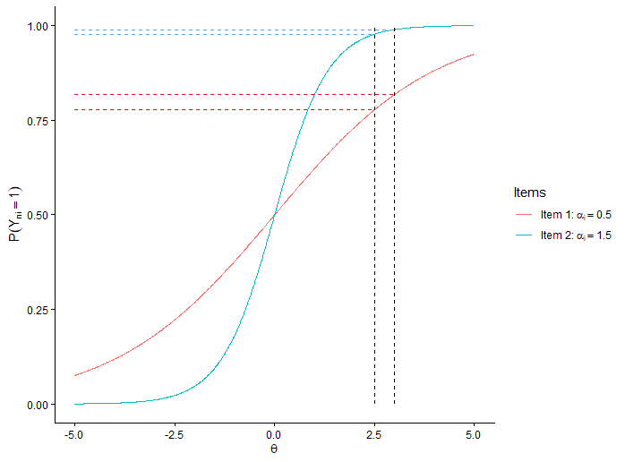{#fig-2PL-expl-discr2}

::: {.callout-tip appearance="simple"}
## Mathematical background

We can also see the effect of $\alpha_i$ on the information in the mathematical formula for item information

$$\begin{aligned}
I_i(\theta) &= \alpha_i^2 \cdot p(X_i = 1) \cdot p(X_i = 0)\\
&= \alpha_i^2 \cdot \frac{exp(\alpha_i(\theta - \beta_i))}{1 + exp(\alpha_i(\theta - \beta_i))} \cdot \frac{1}{1 + exp(\alpha_i(\theta - \beta_i))}
\end{aligned}$$

We can also see from this, that contrary to the Rasch model the maximal item information can exceed 0.25.
We know that the maximal item information is at the point of the item difficulty.
Since the item difficulty is defined as the point on the $\theta$ scale where the probability of answering the item with a 1 is 50% we get for the point of the item difficulty:

$$I_i(\theta = \beta_i) = \alpha_i^2 \cdot 0.5 \cdot 0.5 = \alpha_i^2 \cdot 0.25$$

As we can see in the 2PL the 0.25 are additionally weighted by the squared item discrimination $\alpha_1$.
Consequently, if $\alpha_i > 1$, then the maximal possible item information is greater than 0.25.
Conversely, if $\alpha_i < 1$, then the maximal possible item information is smaller than 0.25.
:::

In summary, we learned that in the 2PL the item information depends now on two factors:

1.  The distance of the person to the item difficulty ($\theta_n - \beta_i$)

2.  the discrimination parameter $\alpha_i$ (the higher the discrimination, the higher the information around the item difficulty)

#### Test information

As in the Rasch model, the test information is simply the sum of item information over all items:

$$I(\theta) = \sum_{i = 1}^II_i(\theta)$$

::: {.callout-tip appearance="simple"}
## Mathematical background

Mathematically, the test information is based on Fisher's information [@debelak2022, p. 51]:

$$I(\theta_n) = -E\left(\frac{\partial^2 \log P(Y_{ni} = y_{ni}|\theta_n,\beta_i)}{\partial^2\theta_n} \right)$$

From the $\partial^2$, we can see that this includes the second derivative of the log-likelihood.

Simply put, the log-likelihood is the criterion we optimize during parameter estimation.
You can think of it something like this: We define a model (e.g., the Rasch model or 2PL).
This determines the form or structure, since the model must “adhere to” the formula.
However, the formula consists of parameters that are variable.
We can plug in different values here.
This raises the question of which values we should use for our parameters to best fit the model to our observed data.
One possible approach to finding this out is to simply plug in some arbitrary values for the parameters and see how well our model predicts the data with these parameters.
Then we try out different parameter values until we find the best “settings” for the parameters to predict the data.
Of course, this is a simplification of the actual estimation algorithms, but the exact procedere of parameter estimation is not covered in this tutorial.
The point that's relevant here is that we need some kind of quantifiable measure of “how well the model can predict the data” so that our model knows whether the new parameter values are better or worse than the previous ones.
This is exactly what we use the log-likelihood for, because the log-likelihood is, by definition, the logarithm of the probability of the observed data given certain parameter values.
This allows us to establish a clearly definable criterion that an algorithm can optimize.
Specifically, we can instruct the algorithm to try out different parameters until it finds the ones that maximize the log-likelihood.
If this reminds you of the term “maximum likelihood,” you’re absolutely right.

For simplicity’s sake, let’s imagine that our model has only one parameter that we’re trying to estimate.
Then, for each possible parameter value, we could calculate the log-likelihood and create a plot (see @fig-expl-info-2PL).
The x-axis would show the parameter values, and the y-axis would show the log-likelihood.
We want the parameter value (x-value) that has the highest log-likelihood (y-value).
Graphically speaking, we are looking for the peak of the graph.
So, once we identify the maximum, we obtain an estimator for our parameter that best fits our data.
We now not only know our model structure but also have exact values for our model parameters ($\theta_n$ and $\beta_i$).

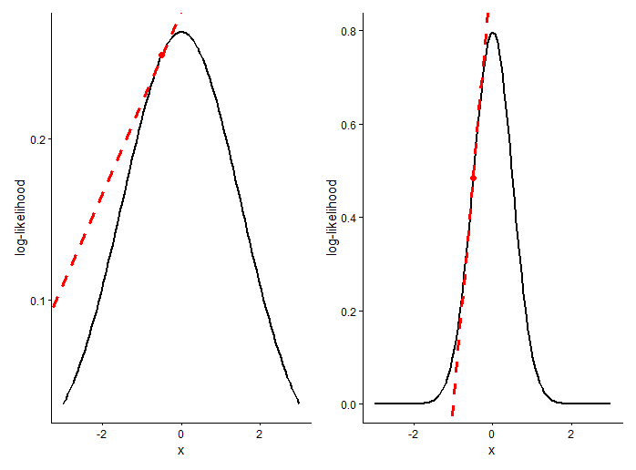{#fig-expl-info-2PL}

But how does this all relate to the information and how does the second derivative come into play?
Let's remember, information is a measure of measurement precision.
Therefore, we could ask, how certain we are that the parameter values we estimated based on the log-likelihood are the best or true solution of the estimation problem?
To answer this question we have two ask a different question: When is it easy to find the maximum value of the log-likelihood (because at the maximum lies our best parameter value for the given data)?
It's easy to find the highest point when we have a distinct or pointed peak.
If the peak is relatively broad and flat, there are many parameter values that can produce similarly high log-likelihood values but are not the optimal parameter values.
So we want a sharp, clearly recognizable peak.
We find this when the slope rises steeply before the maximum and drops steeply again after it.
However, if the slope rises rather gently before the maximum and also drops rather gently afterward, then we end up with a broader peak.
As we learned in school, we know that the first derivative quantifies the slope of our log-likelihood function.
This we can also see in @fig-expl-info-2PL .
In the right plot we have a more peaked maximum and accordingly we see that the first derivative (red dashed line) is much steeper than in the plot on the left.
Accordingly, the second derivative indicates the slope of the first derivative.
This can be interpreted in terms of acceleration or curvature.
The faster the slope of our log-likelihood function increases, the greater the differences in the first derivative between the x-values around the maximum, which means that the slope changes rapidly over a small range.
This means we have a relatively high rate of change, which is reflected in large values of the second derivative.
If the log-likelihood rises slowly around the maximum, the situation is exactly the opposite, and the values of the second derivative are relatively small.
Accordingly, we can use the second derivative to estimate how sharp the peak of our function is and, consequently, how confident we can be in our parameter estimate.
Now it should also become clear why it makes sense for the formula for information to be based on the second derivative.

[Please note, that this intuitive explanation is based on the lecture of @meiser2025]{.mark}
:::

::: {.callout-note appearance="simple"}
## Let's do it in R

Here, too, we can essentially use the exact same code blocks as we did with the Rasch model.
We just need to make sure to pass the 2PL model object to the functions instead of the Rasch model.

To plot the information curve of a sinfle item we can use the `itemplot()` function.

```{r}
# plot item information curve of a specific item

itemplot(eco_2PL, 6, type='info')
```

To plot all item information curves at the same time, we can use the `plot()` function.

```{r}
# plot all item information curves in a single plot
plot(eco_2PL, type="infotrace", theta_lim=c(-5,5), facet = FALSE)

# plot all item information curves in a grid
plot(eco_2PL, type="infotrace", theta_lim=c(-5,5), facet = TRUE)
```

To plot the test information curve we can also use the `plot()` function.

```{r}
# plot test information curve
plot(eco_2PL, type="info")
```

We can also combine different types of information.
To do this, we can look at the various options offered by `type`.
For example, we can use “infoSE” to plot both the information curve and the standard error, or use “infotrace” to plot both the information and the ICC.

```{r}
# plot test information curve with SE
plot(eco_2PL, type="infoSE")

# plot item information curve of a specific item together with ICC
itemplot(eco_2PL,6, type='infotrace')
```
:::

### Difference to the Rasch-model

- ICCs can cross now, because different slopes are possible since $\alpha$ is itemspecific

  - violation of the specific objectivity assumption of the Rasch-Model

### Model comparison

We've now looked at two models: the Rasch model and the 2PL model.
But how do I know which model to choose?
This is a complex question—one that could probably be the subject of a tutorial all its own—and for which there is no single, clear-cut answer.
The “right” model can mean something quite different depending on the researcher’s motivation.
If you have a clear theoretical expectation that you want to test, then the model is determined by that alone, and you’re interested in whether this assumption or model can be upheld based on the observed data.
However, one might also aim to make the best possible predictions and then select the model accordingly.

Therefore, we can rephrase and clarify the question somewhat: How do I know which model fits my data better?

For this we can use model comparison method.
There are different methods to choose from and they have all different advantages and assumptions.

#### Likelihood Ratio Test

This is an inferential statistical test that can be used to compare two models in terms of their fit [see also @deayala2022, p.198].
However, this test can only be applied to hierarchically related (nested) models.
This means that the two models being compared must be convertible into one another—or, in other words, one model must be a special case of the other.
Therefore, there is always a more complex model and a simpler model that can be derived from the restriction of the more complex model.
We are already familiar with this from our Rasch model and the 2PL.
We have already seen that if we fix the $\alpha_i$ parameters in the 2PL to 1 for all items, we obtain the Rasch model.
In this sense, the Rasch model is a special case of the 2PL model.
In other words, the Rasch model is less complex than the 2PL because it has one fewer free parameter than the 2PL, since the $\alpha_i$ values cannot change in the Rasch model.
So we have nested models here and can therefore apply the likelihood ratio test to compare the Rasch model with the 2PL.

The likelihood ratio test is based on the likelihood, which is a measure of how well the model can predict the data or how well the model fits the data.

The test statistic can be calculated using the following formula:

$$-2\Delta\ln(\text{L}) = (-2\ln(\text{L}_\text{S})) - (-2 \ln(\text{L}_\text{C}))$$

Simply put, we are comparing the fit of the simpler model ($S$) to the data with the fit of the more complex model to the data ($C$).
Since we are calculating a difference ($\Delta$), we are looking at how much better the more complex model fits the data than the simpler model.

The convenient thing is that this test statistic, $-2\Delta\ln\text{L}$, follows a chi-squared distribution, so we can use it to perform a significance test.
The number of degrees of freedom ($\Delta \text{df}$) is the difference in the number of freely estimated parameters between the more complex model ($C$) and the simpler model ($S$).
Formally:

$$\begin{align}
-2\Delta\ln(\text{L}) \sim \chi^2(\Delta \text{df})\quad 
\text{with} \; \Delta \text{df} = \text{df}_C - \text{df}_S
\end{align}$$

This test examines the null hypothesis that both models fit the data equally well.

- If the test is significant, it means that the more complex model ($C$) fits the data significantly better than the less complex model ($S$).
  In our example, we would therefore choose the more complex 2PL model over the Rasch model.

- If the test is not significant, it means that the more complex model ($C$) **does not** fit the data significantly better than the less complex model ($S$).
  For reasons of parsimony (see Occam's Razor), we will then choose the simpler model, since there is no advantage to fitting a more complex model to the data.
  In our example, we would therefore choose the simpler Rasch model instead of the 2PL model.

As with all significance tests, however, when dealing with large samples, one should bear in mind that the test may be overpowered, which means that practically everything becomes significant, causing the test to lose its interpretive value.

#### AIC & BIC

AIC stands for Akaike Information Criterion and BIC for Bayesian Information Criterion.
These are descriptive measures of comparison [see also @deayala2022, p.152].
The advantage here is that these measures allow you to also compare models that are not hierarchically related.
The AIC and BIC also take into account the log-likelihood—that is, how well the model fits the data.
In addition, however, the AIC and BIC include a penalty term that penalizes models for being more complex.
This is done because more complex models tend to fit the data slightly better, since they have more freely estimated parameters and can therefore adapt more effectively to the data.
From a research-theoretical perspective, however, we want models that are as parsimonious as possible.
The AIC and BIC reflect this by balancing improvements in the fit against model complexity.
The AIC and BIC are calculated for each model and are computed as follows.

$$\begin{align}
\text{AIC} &= -2\ln(L) + 2\#param\\
\text{BIC} &= -2\ln(L) + \ln(N)\#param
\end{align}$$

In the part to the left of the + in the equation, we see the log-likelihood, i.e., the “model fit” part.
In the part to the right of the + in the equation, we see the penalty term.
$\#param$ refers to the number of freely estimated parameters.
We can see that AIC and BIC calculate the penalty term slightly differently.
However, the logic is the same for both measures.

We can now calculate the AIC and BIC for each model we want to compare, and then always choose the model with the smallest AIC and BIC.

It is important to note that AIC and BIC are purely descriptive measures.
They are therefore not significance tests.
Consequently, it is not possible to say that one model is significantly better than the other based on these measures.

::: {.callout-note appearance="simple"}
## Let's do it in R

We can use the `anova()` function to calculate all model comparison measures introduced in this tutorial at once:

```{r}

# model comparison between Rasch and 2PL:

anova(eco_rasch, eco_2PL)
```

As we can see the Output provides us with a lot of information.
So let's break it down.

The two rows refer to the two models we want to campare.
On the very left we can see the model names.
`eco_rasch` is the simpler model and `eco_2PL` is the more complex model.

In the first and fourth column we can finde the AIC and BIC values for the respective models.

All informations regarding the likelihood ratio test can be found in the four columns to the right: The column `logLik` contains the log-likelihood.
This is the $\ln(L)$ from the formulas aboves.
`X2` gives our test statistic, $-2\Delta\ln\text{L}$.
`df` and `p` contain the corresponding degrees of freedom and the p-value.

So how can we interpret these output with regard to the comparison of our two models?
As we can see the 2PL is preferred over the Rasch model based on all comparison criteria.

1.  The $p$ value of the likelihood ratio test is below 0.05 and therefore significant.
    This means that the 2PL fits the data significantly better than the Rasch Modell

2.  The AIC and BIC are both smaller for the 2PL compared to the Rasch model.
    Thus, even when we incorporate model complexity additionally to model fit in our comparison, the 2PL model is still preferred over the Rasch model given our data set.
:::

## Outlook

In this tutorial, we’ve learned about the Rasch model and the 2PL model and covered the basics of IRT.
Of course, IRT is a much broader field, and there are many other IRT models.
In the area of unidimensional models for dichotomous response formats—which we’ve been exploring so far—there are, for example, the 3PL and 4PL models.
These models are not covered in detail in this tutorial, and readers should be able to familiarize themselves with them independently after completing this tutorial, since the principles introduced here also apply to these models.

Nevertheless, we’ll briefly touch on the core idea behind these models.
As we might already suspect, the higher numbers preceding “PL” indicates additional parameters that are included.

In the **3PL**, an additional item-specific parameter is introduced that can shift the lower asymptote of the ICC upward.
As a result, the minimum possible response probability—the probability of answering “1” for an item—can be significantly greater than 0 for all test-takers.
This can be interpreted as a guessing probability, which the 3PL then allows us to model.

The **4PL** includes an additional item-specific parameter that influences the upper asymptote of the ICC and can thereby shift downward the maximum possible response probability of answering an item with a 1.
This can be interpreted, for example, in terms of interfering factors that cause a person who would otherwise have a high probability to answer an item with a 1 to have a significantly lower response probability for a 1.

In addition to unidimensional models for dichotomous data, the models presented here can also be extended to the multidimensional case.
This means that multiple latent constructs simultaneously influence the response process.
Furthermore, there are also extensions that allow IRT models to be applied to polytomous response formats such as Likert scales.
A prominent example of this is the *Partial Credit Model*.

[Should we mention here that tutorials on polytome answer formats are also coming?]{.mark}

## Additional ressources

- *give some usefull links for further information at the end*
- [How to run IRT analyses in R](https://philippmasur.de/2022/05/13/how-to-run-irt-analyses-in-r/) by Philipp Mansur -\> is doing somthing similar as we are aiming for
- Choi & Asilkalkan (2019). R packages for item response theory analysis: Descriptions and features. <https://doi.org/10.1080/15366367.2019.1586404>
- [PSQF Lecture from Lesa Hoffman](https://www.lesahoffman.com/PSQF6249/index.html): Week 7 and 8

## Review {.appendix}
